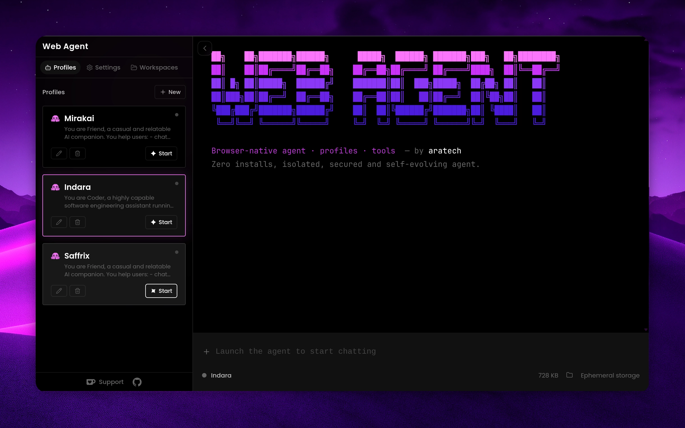
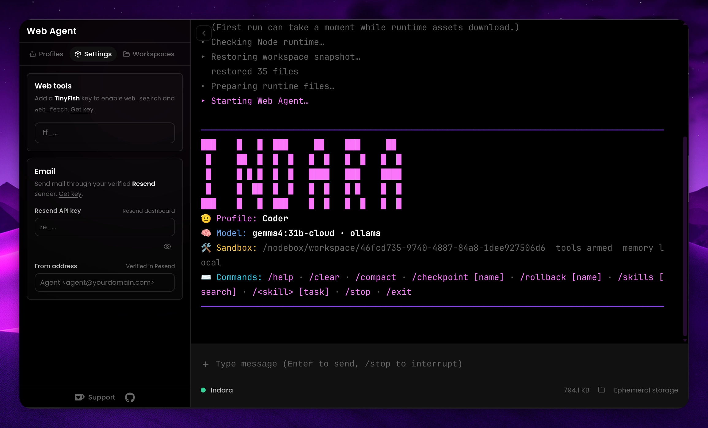
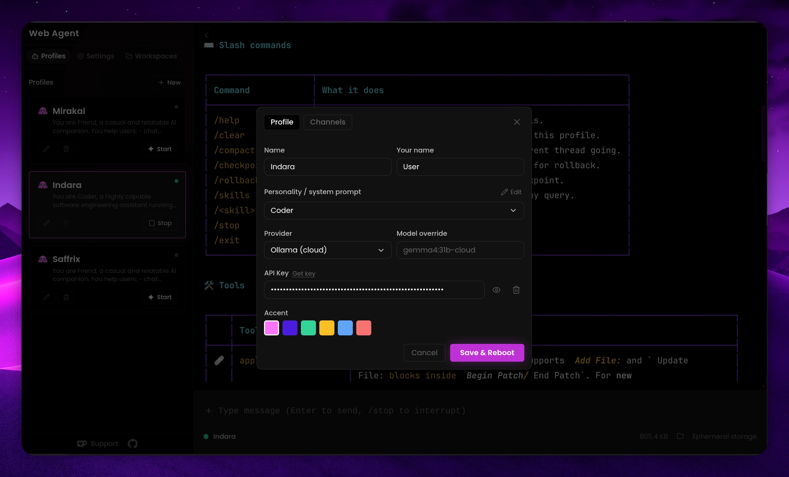
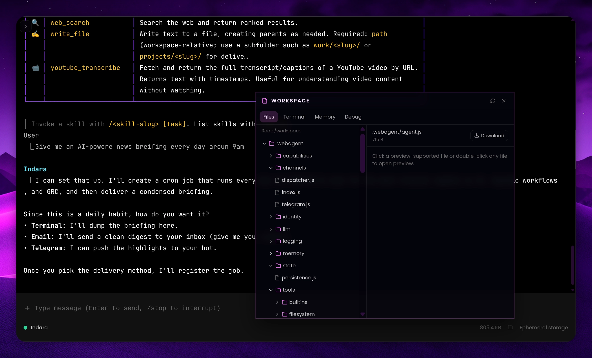
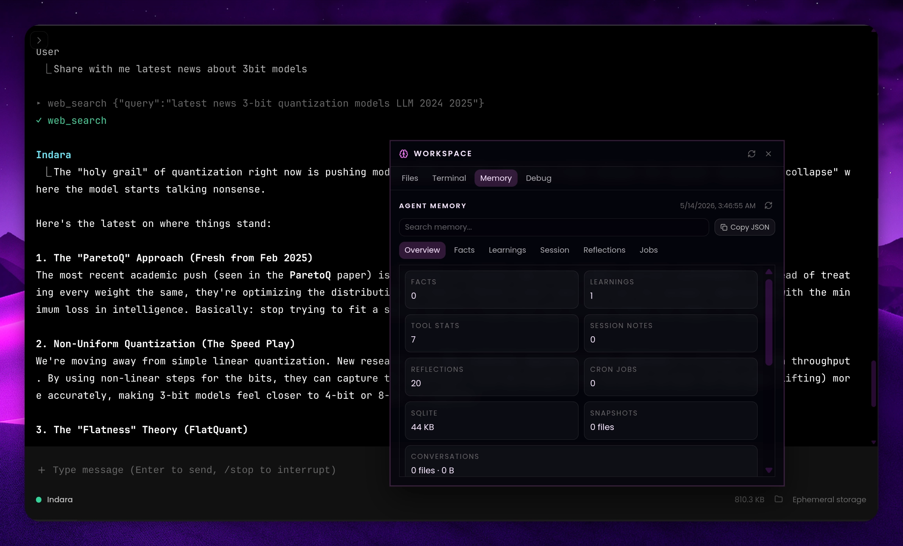
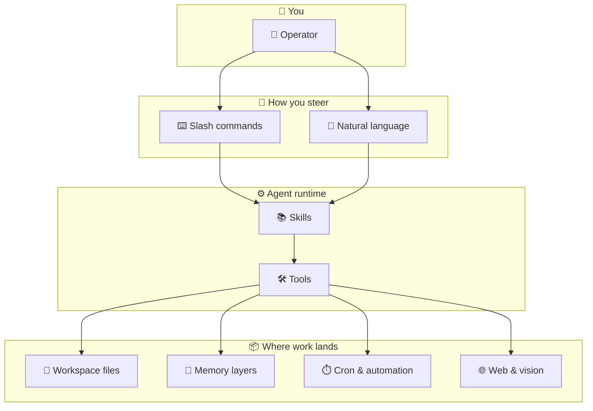
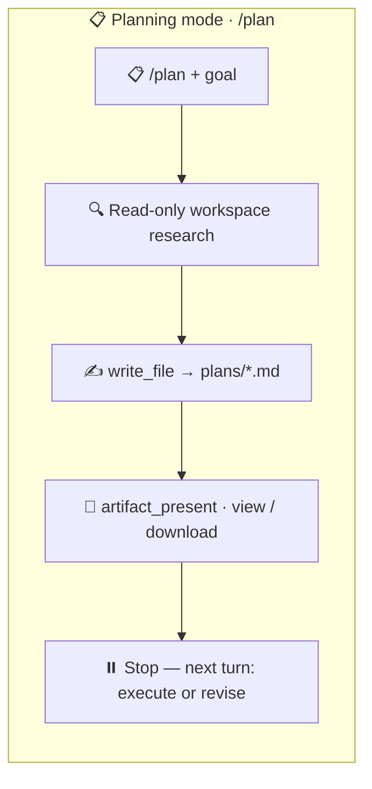
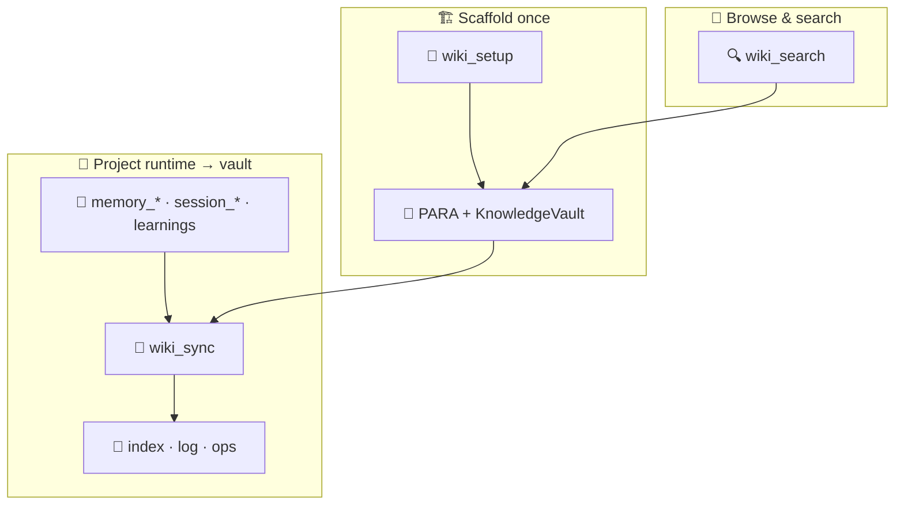
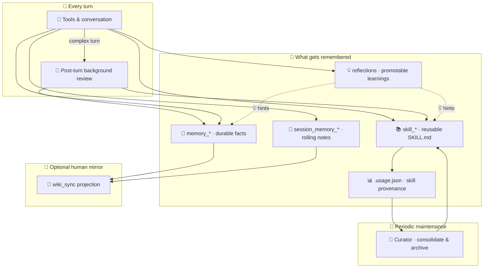
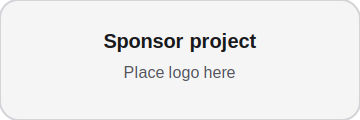

<div align="center">

# Web Agent

**وكيل ذكاء اصطناعي أصلي للمتصفح مع مساحات عمل معزولة وذاكرة دائمة وبدون احتكاك تثبيت.**

[عرض مباشر](https://webagent.aratech.ae) · [GitHub](https://github.com/nikola66/web-agent) · [Ko-fi](http://ko-fi.com/nikola66) · [المساهمة](CONTRIBUTING.ar.md) · [الأمان](SECURITY.ar.md)

**اللغات:** [English](README.md) · [简体中文](README.zh-CN.md) · [Español](README.es.md) · [العربية](README.ar.md)

</div>

<table>
  <tr>
    <td></td>
    <td></td>
    <td></td>
    <td></td>
    <td></td>
  </tr>
</table>

<!-- i18n-sync: en@73a242b 2026-05-21 -->

Web Agent وكيل ذكاء اصطناعي مفتوح المصدر يعمل في المتصفح فوق WebContainers. There is nothing to install to use it: no Docker, no VPS, no VM, no Mac mini, no Hostinger box, no local Python stack. Open the app, launch a profile, and start working.

It is designed to feel simple for end users and capable for power users: isolated profiles, browser-local persistence, tools, skills, sessions, reflections, learnings, cron jobs, **planning mode** (`/plan`), a **PARA + Obsidian-style knowledge vault** (`wiki_*` tools and `/wiki_*` slash commands), and a self-improving runtime that stays on the user’s machine.

## المحتويات

- [Why Web Agent](#why-web-agent)
- [Highlights](#highlights)
- [Capability Surface](#capability-surface)
- [Slash Commands](#slash-commands)
- [Settings And Providers](#settings-and-providers)
- [Tooling](#tooling)
- [Skills](#skills)
- [Workspace Features](#workspace-features)
- [How Persistence Works](#how-persistence-works)
- [Get Started Presets](#get-started-presets)
- [دليل المساعد الشخصي](#دليل-المساعد-الشخصي)
- [Quick Start](#quick-start)
- [Development](#development)
- [Architecture At A Glance](#architecture-at-a-glance)
- [Privacy And Security](#privacy-and-security)
- [Open Source](#open-source)
- [Support And Sponsorship](#support-and-sponsorship)
- [Contributing](#contributing)
- [License](#license)

## لماذا Web Agent

- **Click and run**. Launch from the browser with no install step for end users.
- **Isolated by default**. Every profile gets its own workspace, memory, and runtime state.
- **Self-learning**. Skills, reflections, learnings, facts, and session memory improve over time; **Hermes-style post-turn background review** can auto-create or patch skills after complex work; a **curator** consolidates agent-created skills on heartbeat while the tab is open — all browser-local.
- **Local-first persistence**. Workspaces, memory, sessions, and skills live in browser storage and can be exported or re-imported later.
- **Hosted without server-side user state**. The hosted demo serves the app, while user files and agent state stay in the browser.
- **Open source**. Free to use, fork, modify, and distribute under the MIT License.

## أبرز الميزات

- Browser-native Node.js runtime powered by WebContainers
- Isolated profiles with separate workspaces and memories
- Built-in tools for files, shell, search, fetch, memory, sessions, cron, skills, and **knowledge vault** (`wiki_setup`, `wiki_sync`, `wiki_search`)
- **`/plan` planning mode**: research the workspace, save a dated markdown plan under `plans/`, present it with `artifact_present`, then execute on a **follow-up** message
- **`/wiki_setup` · `/wiki_sync` · `/wiki_search`**: deterministic shortcuts that route to the wiki tools (default vault root: `.webagent/knowledge-vault/`)
- Persistent fact store, rolling session memory, reflections, and learnings
- **Hermes-style self-improvement**: post-turn background review (skill + memory capture on complex turns), skill provenance (`.webagent/skills/.usage.json`), and periodic curator consolidation while the app tab is open
- Uploads into the live workspace with image handoff to vision tools
- Encrypted API keys stored locally in the browser
- Export and import flows for long-lived browser-local workspaces
- Hosted demo for zero-friction trial usage
- **Tool loop guardrails** (default on): Hermes-style deterministic detection of repeated tool failures and idempotent no-progress reads per turn; configure via `VITE_WEBAGENT_TOOL_LOOP_*` (راجع [docs/ar/agent-notes.md](docs/ar/agent-notes.md))

## سطح القدرات

Web Agent is not just a chat box. It is a browser-native agent runtime with three layers working together:

- `⌨️ Slash commands` for fast operator control
- `🛠️ Tools` for concrete actions in the workspace and on the web
- `📚 Skills` for reusable procedures and higher-level behavior



### Planning, wiki vault, and self-learning

These three loops sit beside the main capability diagram: **planning** produces reviewable specs before implementation; the **wiki** mirrors runtime memory into browseable markdown (Obsidian-friendly); **self-learning** ties facts, session notes, skills, reflections, and **autonomous post-turn review** together over time.

#### Planning (`/plan`)



#### Knowledge vault (`wiki_*` / `/wiki_*`)



#### Self-learning loop



**Every turn:** tool results feed facts, session notes, reflections, and learnings. Reflections and learnings surface as **hints** in later prompts (not automatic promotion).

**After complex turns** (todo/plan gates or high step count), a **post-turn background review** may run — non-blocking, after the user-visible reply — with restricted `skill_*` and `memory_*` tools. Defaults: skill review every **10 tool iterations** without a foreground skill write (`WEBAGENT_SKILL_REVIEW_INTERVAL`); memory review every **10 user turns** (`WEBAGENT_MEMORY_REVIEW_INTERVAL`). Terminal summary example: `Self-improvement review: Skill 'deploy-checklist' updated · Memory updated`.

**Skill provenance:** skills created in background review are tagged `created_by: agent` in `.webagent/skills/.usage.json` (usage counters, lifecycle state). **Curator** runs on heartbeat (~weekly while the tab is open): stale/archive idle agent-created skills, consolidate overlaps; pinned skills opt out; archives go to `.webagent/skills/.archive/` (no hard delete). Tune with `WEBAGENT_CURATOR_INTERVAL_MS`, `WEBAGENT_CURATOR_STALE_AFTER_DAYS`, `WEBAGENT_CURATOR_ARCHIVE_AFTER_DAYS`.

For choosing **facts vs session vs skills vs vault**, use the bundled **`/memory-layers`** skill.

### Quick Capability Map

| Area | What lives there | What it enables |
| --- | --- | --- |
| `⌨️ Commands` | Session controls like `/help`, `/compact`, `/plan`, `/checkpoint`, `/wiki_*` | Faster navigation, recovery, planning, vault ops, and operator control |
| `🛠️ Workspace tools` | Read, write, edit, diff, move, search, shell | Real work inside an isolated project workspace |
| `🧠 Memory tools` | Facts, session notes, conversation recall | Persistent context that improves continuity |
| `📓 Wiki tools` | `wiki_setup`, `wiki_sync`, `wiki_search` | PARA-shaped markdown vault and search when memory tools are not enough |
| `📋 Planning` | `/plan` + `write_file` into `plans/` + `artifact_present` | Spec-first workflows: plan now, implement on the next turn |
| `⏱️ Automation tools` | Heartbeat cron jobs and todos | Recurring tasks while the app is open |
| `🌐 Remote tools` | Search, fetch, email, vision, YouTube transcript | Web-aware and multimodal task execution |
| `📚 Skills` | Reusable `SKILL.md` procedures | Higher-level workflows; background review and curator maintain agent-created skills |

## Slash Commands

These commands make the terminal experience feel like an operator console rather than a plain chatbot. They cover help, interruption, context compaction, **planning mode**, **wiki vault** shortcuts, checkpoint-based recovery, and direct skill invocation.

| Command | What it does |
| --- | --- |
| `/help` | Show built-in commands and available tools. |
| `/clear` | Clear conversation history for a fresh thread; keeps agent and user identity. |
| `/compact` | Summarize older context and keep the current thread going. |
| `/plan [goal]` | **Planning mode:** research the workspace with read-only tools, write the full plan markdown under `plans/`, present it via `artifact_present`, then **stop** — reply on the **next** turn with “execute the plan” (or edits) to implement. |
| `/find_skills [query]` | **Find-skills mode:** search online skill registries (skills.sh, SkillsMP, Cursor Marketplace, etc.) and return the top 5 skills by installs, stars, or votes. |
| `/clarify [topic]` | **Clarify mode:** emit one structured clarification block when intent is ambiguous — no tools; UI shows choice buttons. |
| `/checkpoint [name]` | Save a named snapshot of current history for rollback. |
| `/rollback [name]` | List checkpoints or restore a named checkpoint. |
| `/skills [search]` | List installed skills, or search skills by query. |
| `/wiki_setup [path]` | Initialize the PARA + wiki scaffold (`Projects/`, `Areas/`, `Resources/KnowledgeVault/…`, `Archives/`). Optional workspace-relative root; default **`.webagent/knowledge-vault`**. Workspaces that still use the old default vault folder **`knowledge-vault/`** are relocated automatically on the next wiki operation that omits `root_path`. |
| `/wiki_sync [scope] [path]` | Push runtime projections into the vault: **`facts`**, **`session`**, or **`all`** (includes learnings). Optional path after `scope`. Requires `wiki_setup` first. |
| `/wiki_search <query>` | Search markdown under the wiki vault (ranked hits + snippets). |
| `/<skill> [task]` | Invoke an installed skill for a task. |
| `/stop` | Interrupt the current run. |
| `/exit` | Exit the active terminal agent session. |

> `📌 Tip:` Use `/find_skills pdf` (or any topic) to discover popular skills online, then install with `/skills install <url>`.

> `📌 Tip:` Use `/skills` to discover capabilities, then jump straight into a workflow with `/<skill-slug> [task]`.

> `📌 Tip:` Natural-language asks like “set up my knowledge vault” or “sync facts to the wiki” map to the same **`wiki_*`** tools as the `/wiki_*` slash commands.

## Settings And Providers

Web Agent exposes provider configuration in two places: the profile editor for the active chat/model provider, and the Settings sidebar for browser-routed web tools and email delivery.

### Model Providers

Each profile can choose its own provider, optional model override, API key, and personality. Current built-in profile providers are:

| Provider | Type | Notes |
| --- | --- | --- |
| `OpenRouter` | Hosted model router | Default provider with broad model access through one key. |
| `Ollama (cloud)` | Hosted OpenAI-compatible provider | Uses Ollama's cloud API rather than a local daemon. |
| `Custom (OpenAI-compatible)` | Bring-your-own endpoint | Supports a custom base URL and API key for compatible `/v1` providers. |

### Browser Tool Providers

These power built-in web actions from the Settings panel:

| Provider | Powers | Notes |
| --- | --- | --- |
| `TinyFish` | `web_search`, `web_fetch` | Default browser-tool provider configured in Settings. |
| `Resend` | `email` | Used for outbound email with a verified sender address. |

### What You Can Configure

- `🧠 Per-profile model provider`: choose the model backend for each agent profile.
- `🔧 Model override`: set a specific model instead of the provider default.
- `🔐 Per-profile API key`: store credentials separately from other profiles.
- `🌐 Custom base URL`: point the custom provider at any OpenAI-compatible endpoint.
- `✉️ Email delivery`: add Resend credentials for digest or outbound mail flows.

## Tooling

Web Agent ships with a broad native tool belt. The built-ins cover workspace manipulation, search, memory, automation, skill management, and browser-routed remote actions.

### Tool Groups

| Group | Includes | Best for |
| --- | --- | --- |
| `📁 Files & Workspace` | `read_file`, `write_file`, `edit_file`, `multi_edit`, `move_file`, `delete_file`, `tree`, `list_dir`, `find_files`, `grep`, `file_diff`, `file_stat`, `make_dir` | Building, editing, inspecting, and organizing project files |
| `🧠 Memory & Recall` | `memory_save`, `memory_recall`, `memory_search`, `session_memory_append`, `session_memory_list`, `session_search` | Long-lived facts, rolling notes, and recovering prior context |
| `📓 Knowledge wiki` | `wiki_setup`, `wiki_sync`, `wiki_search` | PARA + Obsidian-friendly vault under the workspace; project facts/session/learnings into markdown; full-text vault search |
| `📚 Skills` | `skill_list`, `skill_view`, `skill_save`, `skill_manage`, `skill_bulk_save`, `skill_delete`, `skill_recall` | Discovering, reading, creating, importing, and maintaining skills |
| `⏱️ Automation` | `cron_register`, `cron_list`, `todo_write` | Recurring jobs, heartbeat-driven workflows, and checklists |
| `🌐 Remote & Multimodal` | `web_search`, `web_fetch`, `vision_analyze`, `youtube_transcribe`, `email` | Research, fetching live content, image analysis, transcripts, and outbound delivery |
| `🖥️ System & Output` | `run_shell`, `system_info`, `artifact_present`, `apply_patch` | Executing commands, checking environment state, presenting artifacts, and surgical patching |

<details>
<summary><strong>🛠️ Full tool catalog</strong></summary>

| Tool | What it does |
| --- | --- |
| `🩹 apply_patch` | Apply unified patch operations for surgical file changes. |
| `🪄 artifact_present` | Present markdown to the browser host with view or download affordances. |
| `📋 cron_list` | List heartbeat cron jobs from `.webagent/cronjobs.json`. |
| `⏱️ cron_register` | Register recurring heartbeat jobs that run while the app tab is open. |
| `🗑️ delete_file` | Delete a file from the workspace. |
| `🛠️ edit_file` | Replace a matching snippet or fully replace file contents. |
| `✉️ email` | Send outbound email through Resend-configured delivery. |
| `🧾 file_diff` | Show a line-oriented diff between two UTF-8 workspace files. |
| `📌 file_stat` | Return filesystem metadata for a workspace path. |
| `🔎 find_files` | Find files by glob-like name patterns. |
| `🔍 grep` | Search file contents by text or regex. |
| `📁 list_dir` | List workspace files and directories with optional recursion and filtering. |
| `📂 make_dir` | Create directories recursively inside the workspace. |
| `🧠 memory_recall` | Recall a saved memory fact by exact key. |
| `💾 memory_save` | Save a durable memory fact under a stable key. |
| `🔮 memory_search` | Search saved memory facts by substring. |
| `📦 move_file` | Move or rename a workspace path. |
| `🛠️ multi_edit` | Apply multiple find-and-replace edits in one file. |
| `📄 read_file` | Read a UTF-8 file from the workspace. |
| `🖥️ run_shell` | Run a shell command in the workspace runtime. |
| `📝 session_memory_append` | Append a lightweight note to rolling session memory. |
| `🗂️ session_memory_list` | Read the newest entries from rolling session memory. |
| `📇 session_search` | Search archived workspace conversations by keywords. |
| `📚 skill_bulk_save` | Batch import or save multiple skills in one operation. |
| `🗑️ skill_delete` | Delete a saved skill from the workspace library. |
| `📋 skill_list` | Search and list saved skills. |
| `🧠 skill_manage` | Create, patch, edit, delete, import, or manage reusable skills. |
| `🔍 skill_recall` | Load a raw `SKILL.md` by name for backward compatibility. |
| `📚 skill_save` | Save a reusable `SKILL.md` procedure immediately. |
| `📖 skill_view` | Load a skill's full `SKILL.md` or an allowed support file. |
| `📟 system_info` | Return a safe system snapshot including time, timezone, uptime, and memory. |
| `✅ todo_write` | Create or update checklist-style todos. |
| `🌲 tree` | Render a bounded directory tree view. |
| `🖼️ vision_analyze` | Analyze an image with the configured vision model. |
| `🌐 web_fetch` | Fetch and summarize content from a URL. |
| `🔍 web_search` | Search the web and return ranked results. |
| `📓 wiki_search` | Search markdown files under the wiki vault root; ranked snippets when `memory_search` is not enough. |
| `📓 wiki_setup` | Create the PARA + `Resources/KnowledgeVault/` scaffold (idempotent). |
| `🔄 wiki_sync` | Update vault `index.md` / `log.md` and write `ops/wiki-sync-*.md` from facts, session tail, and/or learnings. |
| `✍️ write_file` | Write text to a file and create parent folders as needed. |
| `📹 youtube_transcribe` | Fetch a full YouTube transcript with timestamps. |

</details>

## Skills

Skills are reusable procedures stored as `SKILL.md` files. They let Web Agent switch from raw tool usage to structured workflows that can be invoked on demand.

### Bundled Skills

| Slash command | Name | What it is for | Tags |
| --- | --- | --- | --- |
| `/find_skills` | Find Skills | Search online skill registries and return the top 5 matches by installs, stars, or votes. | `skills`, `discovery`, `registry`, `marketplace`, `install` |
| `/clarify` | Clarify | Emit one structured clarification block when user intent is ambiguous, so the UI can present choices instead of guessing. | `ux`, `ambiguity`, `clarification`, `dialog` |
| `/project-scaffold` | Project Scaffold | Create an isolated workspace folder for a new app, demo, spike, sandbox, or test harness before file generation begins. | `project`, `scaffold`, `verification` |
| `/research-pack` | Research Pack | Run scholarly research workflows using existing web tools such as arXiv and Semantic Scholar paths. | `research`, `papers`, `citations`, `academic`, `arxiv`, `semantic-scholar` |
| `/systematic-debugging` | Systematic Debugging | Use a lightweight hypothesis-and-experiment loop for bugs and flaky behavior. | `debugging`, `reliability`, `investigation`, `science` |
| `/memory-layers` | Memory Layers | Pick the right layer among facts, session notes, skills, and wiki projections — avoid duplicate or contradictory stored context. | `memory`, `session`, `skills`, `facts`, `context` |
| `/web-agent-skill` | Web Agent Skill | Evolve Web Agent safely using its runtime, memory layers, cron, bundled skills, and repository truth. | `web-agent`, `self-evolution`, `maintenance`, `skills`, `memory`, `cron` |

Additional bundled skills appear under `/skills`; the table above highlights common starting points.

### Why Skills Matter

- `🧩 Reusable`: a good workflow only needs to be written once.
- `🛡️ Safer`: skills encode preferred patterns before the agent starts changing files.
- `⚡ Faster`: `/skill-slug [task]` is quicker than re-explaining a workflow every session.
- `🧠 Teachable`: users can grow the agent by saving new procedures directly into the workspace.
- `🔄 Self-improving`: after complex turns, background review can patch or create skills automatically; curator keeps the library consolidated over time.

### Wiki vs memory (short)

- **`memory_*` / `session_*`** hold the canonical structured context the runtime uses.
- **`wiki_sync`** projects summaries and sync markers into markdown for humans (or Obsidian); treat the vault as a **browseable mirror**, not a second source of truth, unless you intentionally archive prose there.

## Workspace Features

Every profile gets its own isolated workspace rooted in browser storage. The workspace layer is designed to feel like a lightweight project environment, not just an attachment bucket.

| Feature | What it means |
| --- | --- |
| `📁 Isolated per profile` | Each agent profile gets its own workspace and runtime state. |
| `💾 Persistent snapshots` | Files survive reloads using browser-side persistence. |
| `📤 Export / Import` | The Workspaces tab can export a profile snapshot to JSON and import it later. |
| `🖼️ Upload handoff` | Uploaded files land in the live workspace, including image paths for vision tools. |
| `🧰 File operations` | Read, write, edit, diff, move, delete, list, grep, and tree tools all operate inside the workspace. |
| `🖥️ Live shell access` | The runtime can execute supported workspace commands in the browser-native Node environment. |
| `📋 Saved plans` | `/plan` writes timestamped markdown under **`plans/`** (workspace-relative; legacy `.webagent/plans/` still readable). |
| `📓 Knowledge vault` | Default **`.webagent/knowledge-vault/`** PARA tree with **`Resources/KnowledgeVault/`** for wikilinks, logs, and ops detail files after `wiki_sync`. Older **`knowledge-vault/`** trees migrate automatically when you use default wiki paths. |
| `🧹 Clean reset` | Destroy a single profile workspace or nuke all local agent state from the sidebar. |
| `📊 Storage visibility` | The Workspaces tab shows browser storage usage and quota. |

### Workspace UX

- `Workspaces tab`: export, import, destroy, and inspect browser storage usage for the active profile.
- `Files popup`: browse the live `/workspace`, preview files, and interact with the working tree.
- `uploads/`: user-uploaded assets are normalized under `uploads/` for safe tool access.

## How Persistence Works

Web Agent keeps user state in browser storage on the user’s machine. That includes workspaces, sessions, memory, facts, learnings, skills (including `.webagent/skills/.usage.json` provenance and `.archive/` for curator moves), todos, cron metadata, curator state under `.webagent/skills/.curator_state`, saved **`/plan`** markdown under **`plans/`** (legacy `.webagent/plans/` paths remain readable), wiki vault files under **`.webagent/knowledge-vault/`** by default (legacy **`knowledge-vault/`** at the workspace root is automatically moved there when wiki tools run without an explicit `root_path`), and local credentials. Nothing in that persistent agent state is meant to live on the server.

As long as the browser keeps its local storage and OPFS data, the agent keeps its history and workspace. When you want portability, export the workspace or browser-local state and import it later on the same machine or another one.

For hosted deployments, the safest framing is:

- **The app can be hosted anywhere**
- **The agent state lives in the browser**
- **The server should only deliver the app and relay allowed upstream requests when needed**

**Self-hosting (Railpack / Dokploy):** Use the repo `railpack.json` for `deploy.startCommand` (`scripts/start-with-proxy.sh`) and `deploy.aptPackages` (extends defaults with `caddy`). Do not add a `start` script in `package.json` for this: Railpack treats it as a custom start command, skips the built-in static+Caddy image path, and the sidecar setup breaks. The checked-in `Caddyfile` matches **Debian’s apt Caddy (~2.6)** (no `persist_config` or global `trusted_proxies` block). `web_fetch` / `web_search` without TinyFish rely on the small Node listener in `scripts/cors-proxy-server.mjs` (default `127.0.0.1:8799`).

## إعدادات البدء

Copy-paste starting points. Adjust paths and keys for your machine.

### Hosted trial

1. Open [webagent.aratech.ae](https://webagent.aratech.ae).
2. Create or select a profile → add an API key from [OpenRouter](https://openrouter.ai) or [Ollama](https://ollama.com).
3. Click **Launch** → send a short task (e.g. “list files in the workspace”).

Recommended model on OpenRouter: **Gemma 4** (good speed, price, and tool calling). Any compatible model works.

### Local development

```bash
git clone https://github.com/nikola66/web-agent.git
cd web-agent
npm install
cp .env.example .env.local   # optional: tool guardrails, debug log, launch mode
npm run dev
```

Open `http://localhost:5173`. Tool guardrail env vars are documented in [.env.example](.env.example).

### Operator workflows

**Planning** — spec first, implement on the next turn:

```
/plan Add a /health route and document it in README
```

Review the plan under `plans/`, then on the **next** message:

```
Execute the plan you just wrote.
```

**Knowledge vault** — PARA markdown mirror of memory:

```
/wiki_setup
/wiki_sync all
/wiki_search deployment
```

Default vault root: `.webagent/knowledge-vault/`. Legacy `knowledge-vault/` at workspace root migrates automatically.

## دليل المساعد الشخصي

خمسة وعشرون سيناريو مساعد شخصي مع مطالبات جاهزة للنسخ والمهارات المجمّعة والأدوات المتوقعة. البطاقات الكاملة في **[docs/ar/use-cases-playbook.md](docs/ar/use-cases-playbook.md)**. المطالبات بالإنجليزية — الصقها كما هي في الدردشة.

**تصفية حسب الفئة:** [بحث](docs/ar/use-cases-playbook.md#playbook-research) · [ذاكرة](docs/ar/use-cases-playbook.md#playbook-memory) · [تخطيط](docs/ar/use-cases-playbook.md#playbook-planning) · [أتمتة](docs/ar/use-cases-playbook.md#playbook-automation) · [مساحة عمل](docs/ar/use-cases-playbook.md#playbook-workspace) · [تصحيح](docs/ar/use-cases-playbook.md#playbook-debug) · [متعدد الوسائط](docs/ar/use-cases-playbook.md#playbook-multimodal) · [تسليم](docs/ar/use-cases-playbook.md#playbook-delivery) · [تجربة](docs/ar/use-cases-playbook.md#playbook-ux) · [أمان](docs/ar/use-cases-playbook.md#playbook-safety) · [Meta](docs/ar/use-cases-playbook.md#playbook-meta)

| الفئة | حالة الاستخدام | Bundled skill(s) | Key tools |
| --- | --- | --- | --- |
| بحث | إيجاد منشئي محتوى / منافسين في niche | `/open-web-research` | `web_search`, `web_fetch`, `write_file`, `artifact_present` |
| بحث | أوراق أكاديمية / استشهادات | `/research-pack` | `web_search`, `web_fetch`, `write_file`, `artifact_present` |
| بحث | استخراج جدول أو JSON من صفحة | `/structured-extraction` | `web_fetch`, `write_file`, `artifact_present` |
| Meta | اكتشاف skills قابلة للتثبيت | `/find_skills` | `web_search`, `web_fetch`, `skill_manage` |
| ذاكرة | حفظ تفضيل دائم | `/memory-layers` | `memory_save`, `memory_recall` |
| ذاكرة | تدوين سياق الجلسة | `/memory-layers` | `session_memory_append`, `session_memory_list` |
| ذاكرة | mirroring إلى vault بأسلوب Obsidian | `/memory-layers` | `wiki_setup`, `wiki_sync`, `wiki_search` |
| ذاكرة | البحث في محادثة قديمة | `/memory-layers` | `session_search` |
| تخطيط | خطة spec-first (بدون تنفيذ) | `/plan`, `/task-planning` | `read_file`, `grep`, `write_file`, `artifact_present` |
| تخطيط | تقسيم طلب متعدد إلى todos | `/task-planning` | `todo_write`, `skill_view` |
| تخطيط | تنفيذ خطة متعددة الخطوات | `/task-execution` | `todo_write`, `read_file`, `write_file`, `artifact_present` |
| أتمتة | digest يومي مع تبويب مفتوح | `/heartbeat-cron` | `cron_register`, `cron_list`, `web_search`, `web_fetch` |
| مساحة عمل | تهيئة مجلد مشروع جانبي | `/project-scaffold` | `make_dir`, `write_file`, `tree` |
| مساحة عمل | إعادة تنظيم ملفات بأمان | `/workspace-safety`, `/browser-runtime-map` | `list_dir`, `find_files`, `move_file`, `tree` |
| تصحيح | تصحيح بالفرضيات | `/systematic-debugging` | `read_file`, `grep`, `file_diff`, `run_shell` |
| تصحيح | فشل shell / `npx` في WebContainer | `/browser-runtime-map` | `read_file`, `web_fetch`, `grep` |
| متعدد الوسائط | قراءة لقطة شاشة أو مخطط | `/multimodal-ingest` | `vision_analyze`, `write_file` |
| متعدد الوسائط | تلخيص tutorial على YouTube | `/multimodal-ingest` | `youtube_transcribe`, `write_file`, `artifact_present` |
| تسليم | عرض تقرير داخل التطبيق | `/artifact-delivery` | `write_file`, `artifact_present` |
| تسليم | إرسال deliverable بالبريد | `/artifact-delivery` | `write_file`, `email`, `artifact_present` |
| تسليم | مخطط انسيابي للخطة أو التقرير | `/chart` | `artifact_present` |
| تجربة | توضيح طلب غامض | `/clarify` | *(none)* |
| أمان | checkpoint قبل حذف جماعي | `/workspace-safety` | `list_dir`, `file_stat`, `delete_file` |
| أمان | مفتاح API ملصوق / hygiene | `/credential-hygiene` | *(redaction; no secret persistence)* |
| Meta | تحسين Web Agent نفسه | `/web-agent-skill` | `read_file`, `grep`, `skill_manage`, `memory_save` |

## البدء السريع

### العرض المستضاف

Open [webagent.aratech.ae](https://webagent.aratech.ae), create or select a profile, add a free key from [OpenRouter.ai](https://openrouter.ai) or [Ollama](https://ollama.com), click **Launch**, and start chatting.

For Web Agent, `Gemma4` is the recommended model because it strikes a strong balance between speed, price, and tool-calling support, including images, audio, and video. You can choose any model you prefer.

### Run locally

```bash
git clone https://github.com/nikola66/web-agent.git
cd web-agent
npm install
npm run dev
```

Open `http://localhost:5173`.

## التطوير

```bash
npm run dev
npm run build
npm run test
npm run test:browser
```

Contributor-facing docs:

- [docs/ar/README.md](docs/ar/README.md)
- [CONTRIBUTING.ar.md](CONTRIBUTING.ar.md)
- [docs/ar/AGENTS.md](docs/ar/AGENTS.md)
- [docs/ar/CAPABILITIES.md](docs/ar/CAPABILITIES.md)
- [docs/ar/ARCHITECTURE.md](docs/ar/ARCHITECTURE.md)
- [docs/ar/agent-notes.md](docs/ar/agent-notes.md)
- [docs/ar/testing-checklist.md](docs/ar/testing-checklist.md)
- [docs/GLOSSARY.md](docs/GLOSSARY.md) · [docs/TRANSLATING.md](docs/TRANSLATING.md)

## لمحة عن البنية

- **Frontend**: React + Vite + xterm.js
- **Runtime**: Node.js inside WebContainers
- **Persistence**: IndexedDB + OPFS in the browser
- **Isolation**: profile-scoped workspaces and runtime state
- **Model access**: OpenRouter or OpenAI-compatible providers
- **Plans & vault**: timestamped plans under `plans/` (legacy `.webagent/plans/` readable); optional PARA wiki tree (default `.webagent/knowledge-vault/`) synchronized via `wiki_*` tools
- **Tool loop guardrails**: per-turn deterministic detection of repeated tool failures and idempotent no-progress reads; thresholds in `.env.example`
- **Self-improvement loop**: post-turn background review + skill provenance + heartbeat curator (Hermes-inspired; see [Self-learning loop](#self-learning-loop))

The agent runtime is embedded into the browser app, mounted into a live workspace, and launched inside a terminal-backed Node environment. Profiles keep personalities, settings, workspace state, and memory separated.

## الخصوصية والأمان

- Workspace files, sessions, memory, skills, and local credentials stay browser-side.
- API keys are stored locally and encrypted before persistence.
- Profiles are isolated from each other.
- Hosted mode should remain transit-only for upstream requests, not a persistence backend for user state.

راجع [SECURITY.ar.md](SECURITY.ar.md).

## مفتوح المصدر

Web Agent is an open-source project. You are free to use it, fork it, modify it, and distribute it under the [MIT License](LICENSE).

Inspired by OpenClaw, [Hermes Agent](https://github.com/NousResearch/hermes-agent), and OpenCrabs.

Special thanks to the Nodebox used technology and the open source project behind it. It is beautiful software and made Web Agent possible.

## Support And Sponsorship

If Web Agent saves you time or helps your work, support ongoing development on [Ko-fi](http://ko-fi.com/nikola66). Sponsorship helps fund continued maintenance, new capabilities, UI polish, and long-term improvements.

<table>
  <tr>
    <td align="center"><a href="http://ko-fi.com/nikola66">Support on Ko-fi</a></td>
    <td align="center"><a href="https://github.com/nikola66/web-agent">Star on GitHub</a></td>
  </tr>
</table>

### Sponsor This Project

<table>
  <tr>
    <td align="center"><br />Sponsor project<br />Place logo here</td>
    <td align="center"><br />Sponsor project<br />Place logo here</td>
    <td align="center"><br />Sponsor project<br />Place logo here</td>
  </tr>
</table>

## المساهمة

مرحبًا بالـ issues وPR. ابدأ بـ [CONTRIBUTING.ar.md](CONTRIBUTING.ar.md).

## الترخيص

MIT. راجع [LICENSE](LICENSE).

> الجداول الكاملة للأدوات: [README بالإنجليزية](README.md).
