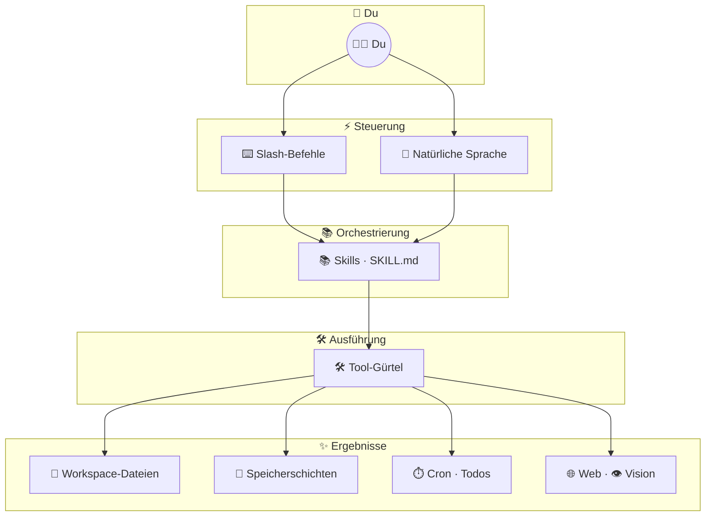
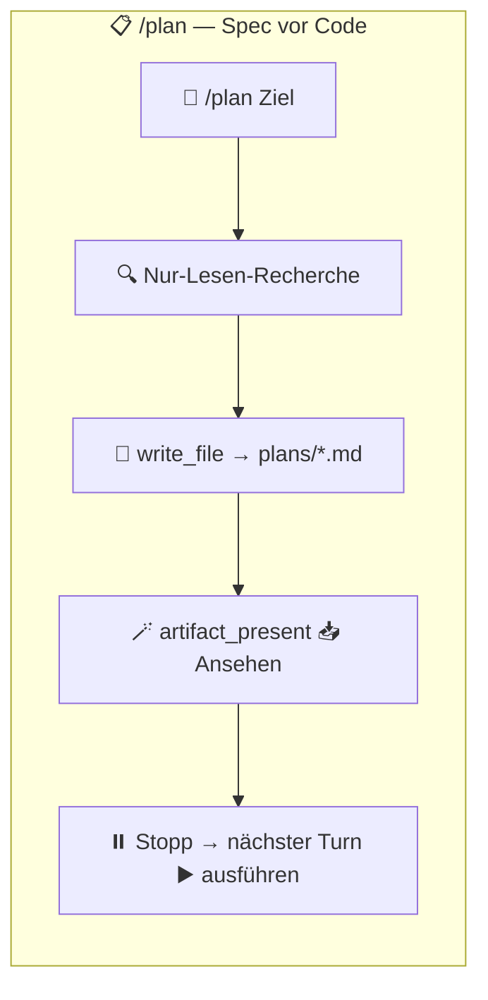
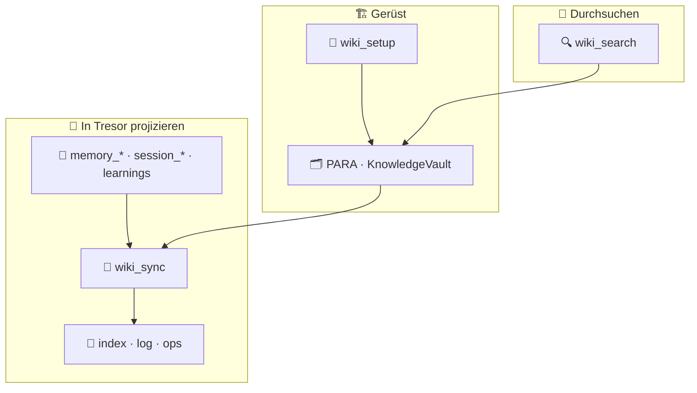
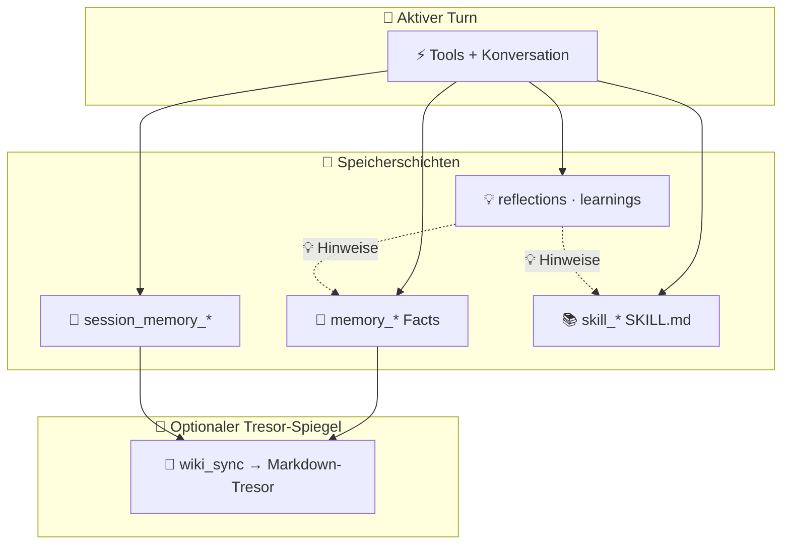

<div align="center">

# Web Agent

**Browser-nativer KI-Agent mit isolierten Workspaces, persistentem Gedächtnis und ohne Setup-Hürde.**

[Live-Demo](https://webagent.aratech.ae) · [GitHub](https://github.com/nikola66/web-agent) · [Unterstützen auf Ko-fi](http://ko-fi.com/nikola66) · [Mitwirken](CONTRIBUTING.de.md) · [Sicherheit](SECURITY.md)

**Sprachen:** [English](README.md) · [Español](README.es.md) · [简体中文](README.zh-CN.md) · [Deutsch](README.de.md)

</div>

<table>
  <tr>
    <td></td>
    <td></td>
    <td></td>
    <td></td>
    <td></td>
  </tr>
</table>

Web Agent ist ein Open-Source-KI-Agent, der direkt im Browser auf WebContainers läuft. Für die Nutzung ist nichts zu installieren: kein Docker, kein VPS, keine VM, kein Mac mini, kein Hostinger-Box, kein lokaler Python-Stack. App öffnen, Profil starten und loslegen.

Er soll sich für Endnutzer einfach und für Power-User leistungsfähig anfühlen: isolierte Profile, browser-lokale Persistenz, Tools, Skills, Sessions, Reflections, Learnings, Cron-Jobs, **Planungsmodus** (`/plan`), ein **PARA- + Obsidian-artiger Wissens-Tresor** (`wiki_*`-Tools und `/wiki-*`-Befehle) und eine sich selbst verbessernde Runtime, die auf dem Rechner des Nutzers bleibt.

## Inhalt

- [Warum Web Agent](#warum-web-agent)
- [Schnellstart](#schnellstart)
- [Highlights](#highlights)
- [So funktioniert es](#so-funktioniert-es)
- [Slash-Befehle](#slash-befehle)
- [Einstellungen und Anbieter](#einstellungen-und-anbieter)
- [Werkzeuge](#werkzeuge)
- [Skills](#skills)
- [Workspace-Funktionen](#workspace-funktionen)
- [Persistenz und Hosting](#wie-persistenz-funktioniert)
- [Entwicklung](#entwicklung)
- [Architektur auf einen Blick](#architektur-auf-einen-blick)
- [Datenschutz und Sicherheit](#datenschutz-und-sicherheit)
- [Mitwirken](#mitwirken)

## Warum Web Agent

- **Klicken und loslegen**. Start aus dem Browser — für Endnutzer kein Installationsschritt.
- **Standardmäßig isoliert**. Jedes Profil erhält eigenen Workspace, eigenes Gedächtnis und eigenen Runtime-Zustand.
- **Selbstlernend**. Skills, Reflections, Learnings, Facts, Session-Memory und optionale Wiki-Projektionen helfen dem Agenten, sich im Laufe der Zeit zu verbessern — ohne die browser-lokale Kontrolle zu verlieren.
- **Local-first-Persistenz**. Workspaces, Memory, Sessions und Skills liegen im Browser-Speicher und können exportiert oder später wieder importiert werden.
- **Gehostet ohne serverseitigen Nutzerzustand**. Die gehostete Demo liefert die App; Nutzerdateien und Agent-Zustand bleiben im Browser.
- **Kleiner Turn-State-Judge**. Ein leichtgewichtiger ONNX-Sidecar klassifiziert continue/stop/ask_user, damit die Runtime keine fragilen Regex-Orchestrierung braucht; deterministische Sicherheit bleibt in `turn.ts`.
- **Open Source**. Frei nutzbar, forken, anpassen und unter der MIT-Lizenz verbreiten.

## Highlights

- Browser-nativer Node.js-Runtime auf Basis von WebContainers
- Isolierte Profile mit getrennten Workspaces und Memories
- Eingebaute Tools für Dateien, Shell, Suche, Fetch, Memory, Sessions, Cron, Skills und **Wissens-Tresor** (`wiki_setup`, `wiki_sync`, `wiki_search`)
- **`/plan` Planungsmodus**: Workspace recherchieren, datierten Markdown-Plan unter `plans/` speichern, mit `artifact_present` präsentieren, dann auf einer **Folgenachricht** ausführen
- **`/wiki_setup` · `/wiki_sync` · `/wiki_search`**: deterministische Shortcuts zu den Wiki-Tools (Standard-Tresor-Root: `.webagent/knowledge-vault/`)
- Persistenter Fact-Store, rollierendes Session-Memory, Reflections und Learnings
- Uploads in den live Workspace mit Bild-Übergabe an Vision-Tools
- Verschlüsselte API-Keys, lokal im Browser gespeichert
- Export- und Import-Flows für langlebige browser-lokale Workspaces
- Gehostete Demo für risikofreies Ausprobieren
- **Turn-Judge**-Sidecar (`server/turn-judge`): Fastify + ONNX für stop/continue/ask_user ohne Regex-Gatekeeping-Stapel

## Schnellstart

Wähle einen Weg:

| Weg | Am besten für |
| --- | --- |
| [Gehostete Demo](#gehostete-demo-nutzen) | Keine Installation — App öffnen und API-Key eintragen |
| [Lokale Entwicklung](#lokal-ausführen) | Mitwirkende, eigene Builds oder Offline-Nutzung |

### Gehostete Demo nutzen

Öffne [webagent.aratech.ae](https://webagent.aratech.ae), erstelle oder wähle ein Profil, füge einen kostenlosen Key von [OpenRouter.ai](https://openrouter.ai) oder [Ollama](https://ollama.com) hinzu, klicke **Launch** und starte den Chat.

`Gemma4` ist ein starker Standard auf OpenRouter (Geschwindigkeit, Preis, Tool Calling, multimodal). Jedes kompatible Modell funktioniert.

### Lokal ausführen

```bash
git clone https://github.com/nikola66/web-agent.git
cd web-agent
git lfs install
git lfs pull
npm install
npm run dev
```

Öffne `http://localhost:5173`. Python wird nur zum erneuten Trainieren des Turn Judges benötigt; das gebündelte ONNX-Modell liegt unter `models/turn-judge/`. Siehe [docs/turn-judge.md](docs/turn-judge.md).

## So funktioniert es

Web Agent ist nicht nur eine Chatbox. Es ist eine browser-native Agent-Runtime mit drei zusammenarbeitenden Schichten:

- `⌨️ Slash-Befehle` für schnelle Operator-Kontrolle
- `🛠️ Tools` für konkrete Aktionen im Workspace und im Web
- `📚 Skills` für wiederverwendbare Abläufe und höherwertiges Verhalten



### Planung, Wiki-Tresor und Selbstlernen

Diese drei Schleifen liegen neben dem Haupt-Capability-Diagramm: **Planung** erzeugt überprüfbare Specs vor der Implementierung; das **Wiki** spiegelt Runtime-Memory in durchsuchbares Markdown (Obsidian-freundlich); **Selbstlernen** verknüpft Facts, Session-Notizen, Skills und Reflections über die Zeit.

#### Planung (`/plan`)



#### Wissens-Tresor (`wiki_*` / `/wiki_*`)



#### Selbstlern-Schleife



Zur Wahl zwischen **Facts, Session, Skills und Tresor** nutze den mitgelieferten Skill **`/memory-layers`**.

### Kurze Capability-Übersicht

| Bereich | Was dort liegt | Was es ermöglicht |
| --- | --- | --- |
| `⌨️ Befehle` | Session-Steuerung wie `/help`, `/compact`, `/plan`, `/checkpoint`, `/wiki_*` | Schnellere Navigation, Recovery, Planung, Tresor-Ops und Operator-Kontrolle |
| `🛠️ Workspace-Tools` | Lesen, Schreiben, Bearbeiten, Diff, Verschieben, Suchen, Shell | Echte Arbeit in einem isolierten Projekt-Workspace |
| `🧠 Memory-Tools` | Facts, Session-Notizen, Gesprächs-Rückruf | Persistenter Kontext für bessere Kontinuität |
| `📓 Wiki-Tools` | `wiki_setup`, `wiki_sync`, `wiki_search` | PARA-förmiger Markdown-Tresor und Suche, wenn Memory-Tools nicht reichen |
| `📋 Planung` | `/plan` + `write_file` nach `plans/` + `artifact_present` | Spec-first-Workflows: jetzt planen, im nächsten Turn implementieren |
| `⏱️ Automatisierung` | Heartbeat-Cron-Jobs und Todos | Wiederkehrende Aufgaben, solange die App offen ist |
| `🌐 Remote-Tools` | Suche, Fetch, E-Mail, Vision, YouTube-Transkript | Web- und multimodale Aufgabenausführung |
| `📚 Skills` | Wiederverwendbare `SKILL.md`-Abläufe | Höherwertige Workflows ohne Modell-Retraining |

## Slash-Befehle

Diese Befehle machen das Terminal-Erlebnis eher zu einer Operator-Konsole als zu einem einfachen Chatbot. Sie decken Hilfe, Unterbrechung, Kontext-Kompaktion, **Planungsmodus**, **Wiki-Tresor**-Shortcuts, Checkpoint-basierte Wiederherstellung und direkten Skill-Aufruf ab.

| Befehl | Was er tut |
| --- | --- |
| `/help` | Eingebaute Befehle und verfügbare Tools anzeigen. |
| `/clear` | Gesprächsverlauf für einen frischen Thread leeren; Agent- und Nutzer-Identität bleiben. |
| `/compact` | Älteren Kontext zusammenfassen und den aktuellen Thread fortsetzen. |
| `/plan [goal]` | **Planungsmodus:** Workspace mit read-only-Tools recherchieren, vollständigen Plan-Markdown unter `plans/` schreiben, per `artifact_present` präsentieren, dann **stoppen** — im **nächsten** Turn mit „execute the plan“ (oder Änderungen) implementieren. |
| `/checkpoint [name]` | Benannten Snapshot des aktuellen Verlaufs für Rollback speichern. |
| `/rollback [name]` | Checkpoints auflisten oder einen benannten Checkpoint wiederherstellen. |
| `/skills [search]` | Installierte Skills auflisten oder per Suchbegriff finden. |
| `/wiki_setup [path]` | PARA- + Wiki-Gerüst initialisieren (`Projects/`, `Areas/`, `Resources/KnowledgeVault/…`, `Archives/`). Optional workspace-relativer Root; Standard **`.webagent/knowledge-vault`**. Workspaces mit altem Standard-Tresor-Ordner **`knowledge-vault/`** werden beim nächsten Wiki-Vorgang ohne `root_path` automatisch umgezogen. |
| `/wiki_sync [scope] [path]` | Runtime-Projektionen in den Tresor schreiben: **`facts`**, **`session`** oder **`all`** (inkl. Learnings). Optionaler Pfad nach `scope`. Erfordert vorher `wiki_setup`. |
| `/wiki_search <query>` | Markdown unter dem Wiki-Tresor durchsuchen (gerankte Treffer + Snippets). |
| `/<skill> [task]` | Installierten Skill für eine Aufgabe aufrufen. |
| `/stop` | Aktuellen Lauf unterbrechen. |
| `/exit` | Aktive Terminal-Agent-Session beenden. |

> `📌 Tipp:` Mit `/skills` Fähigkeiten entdecken, dann direkt mit `/<skill-slug> [task]` in einen Workflow springen.

> `📌 Tipp:` Natürlichsprachliche Anfragen wie „set up my knowledge vault“ oder „sync facts to the wiki“ landen bei denselben **`wiki_*`**-Tools wie die `/wiki_*`-Slash-Befehle.

## Einstellungen und Anbieter

Web Agent bietet Anbieter-Konfiguration an zwei Stellen: im Profil-Editor für den aktiven Chat-/Modell-Anbieter und in der Settings-Sidebar für browser-geroutete Web-Tools und E-Mail-Versand.

### Modell-Anbieter

Jedes Profil kann eigenen Anbieter, optionales Modell-Override, API-Key und Persönlichkeit wählen. Aktuelle eingebaute Profil-Anbieter:

| Anbieter | Typ | Hinweise |
| --- | --- | --- |
| `OpenRouter` | Gehosteter Modell-Router | Standard-Anbieter mit breitem Modellzugang über einen Key. |
| `Ollama (cloud)` | Gehosteter OpenAI-kompatibler Anbieter | Nutzt Ollamas Cloud-API, nicht einen lokalen Daemon. |
| `Custom (OpenAI-compatible)` | Eigenes Endpoint | Unterstützt eigene Base-URL und API-Key für kompatible `/v1`-Anbieter. |

### Browser-Tool-Anbieter

Diese treiben eingebaute Web-Aktionen aus dem Settings-Panel an:

| Anbieter | Treibt an | Hinweise |
| --- | --- | --- |
| `TinyFish` | `web_search`, `web_fetch` | Standard-Browser-Tool-Anbieter in den Einstellungen. |
| `Resend` | `email` | Ausgehende E-Mail mit verifizierter Absenderadresse. |

### Was du konfigurieren kannst

- `🧠 Modell-Anbieter pro Profil`: Modell-Backend für jedes Agent-Profil wählen.
- `🔧 Modell-Override`: konkretes Modell statt Provider-Standard setzen.
- `🔐 API-Key pro Profil`: Credentials getrennt von anderen Profilen speichern.
- `🌐 Eigene Base-URL`: Custom-Provider auf jedes OpenAI-kompatible Endpoint zeigen.
- `✉️ E-Mail-Versand`: Resend-Credentials für Digest- oder Ausgangs-Mail-Flows.

## Werkzeuge

Web Agent bringt einen breiten nativen Tool-Gürtel mit. Die Built-ins decken Workspace-Manipulation, Suche, Memory, Automatisierung, Skill-Verwaltung und browser-geroutete Remote-Aktionen ab.

### Tool-Gruppen

| Gruppe | Enthält | Am besten für |
| --- | --- | --- |
| `📁 Dateien & Workspace` | `read_file`, `write_file`, `edit_file`, `multi_edit`, `move_file`, `delete_file`, `tree`, `list_dir`, `find_files`, `grep`, `file_diff`, `file_stat`, `make_dir` | Erstellen, Bearbeiten, Prüfen und Organisieren von Projektdateien |
| `🧠 Memory & Recall` | `memory_save`, `memory_recall`, `memory_search`, `session_memory_append`, `session_memory_list`, `session_search` | Langlebige Facts, rollierende Notizen und früheren Kontext wiederfinden |
| `📓 Knowledge wiki` | `wiki_setup`, `wiki_sync`, `wiki_search` | PARA- + Obsidian-freundlicher Tresor im Workspace; Facts/Session/Learnings nach Markdown; Volltextsuche im Tresor |
| `📚 Skills` | `skill_list`, `skill_view`, `skill_save`, `skill_manage`, `skill_bulk_save`, `skill_delete`, `skill_recall` | Skills entdecken, lesen, anlegen, importieren und pflegen |
| `⏱️ Automatisierung` | `cron_register`, `cron_list`, `todo_write` | Wiederkehrende Jobs, Heartbeat-Workflows und Checklisten |
| `🌐 Remote & Multimodal` | `web_search`, `web_fetch`, `vision_analyze`, `youtube_transcribe`, `email` | Recherche, Live-Inhalte, Bildanalyse, Transkripte und Auslieferung |
| `🖥️ System & Ausgabe` | `run_shell`, `system_info`, `artifact_present`, `apply_patch` | Befehle ausführen, Umgebung prüfen, Artefakte präsentieren, chirurgisches Patchen |

<details>
<summary><strong>🛠️ Vollständiger Tool-Katalog</strong></summary>

| Tool | Was es tut |
| --- | --- |
| `🩹 apply_patch` | Unified-Patch-Operationen für chirurgische Dateiänderungen anwenden. |
| `🪄 artifact_present` | Markdown dem Browser-Host mit Anzeige- oder Download-Aktionen präsentieren. |
| `📋 cron_list` | Heartbeat-Cron-Jobs aus `.cronjobs.json` auflisten. |
| `⏱️ cron_register` | Wiederkehrende Heartbeat-Jobs registrieren, solange der App-Tab offen ist. |
| `🗑️ delete_file` | Datei aus dem Workspace löschen. |
| `🛠️ edit_file` | Passenden Ausschnitt ersetzen oder Dateiinhalt vollständig ersetzen. |
| `✉️ email` | Ausgehende E-Mail über Resend-konfigurierte Zustellung senden. |
| `🧾 file_diff` | Zeilenorientierten Diff zwischen zwei UTF-8-Workspace-Dateien anzeigen. |
| `📌 file_stat` | Dateisystem-Metadaten für einen Workspace-Pfad zurückgeben. |
| `🔎 find_files` | Dateien per glob-ähnlichen Namensmustern finden. |
| `🔍 grep` | Dateiinhalte per Text oder Regex durchsuchen. |
| `📁 list_dir` | Workspace-Dateien und -Verzeichnisse mit optionaler Rekursion und Filter auflisten. |
| `📂 make_dir` | Verzeichnisse rekursiv im Workspace anlegen. |
| `🧠 memory_recall` | Gespeicherten Memory-Fact per exaktem Key abrufen. |
| `💾 memory_save` | Dauerhaften Memory-Fact unter stabilem Key speichern. |
| `🔮 memory_search` | Gespeicherte Memory-Facts per Substring suchen. |
| `📦 move_file` | Workspace-Pfad verschieben oder umbenennen. |
| `🛠️ multi_edit` | Mehrere Suchen-und-Ersetzen-Edits in einer Datei anwenden. |
| `📄 read_file` | UTF-8-Datei aus dem Workspace lesen. |
| `🖥️ run_shell` | Shell-Befehl in der Workspace-Runtime ausführen. |
| `📝 session_memory_append` | Leichte Notiz zum rollierenden Session-Memory anhängen. |
| `🗂️ session_memory_list` | Neueste Einträge aus dem rollierenden Session-Memory lesen. |
| `📇 session_search` | Archivierte Workspace-Gespräche per Stichwort durchsuchen. |
| `📚 skill_bulk_save` | Mehrere Skills in einem Vorgang importieren oder speichern. |
| `🗑️ skill_delete` | Gespeicherten Skill aus der Workspace-Bibliothek löschen. |
| `📋 skill_list` | Gespeicherte Skills suchen und auflisten. |
| `🧠 skill_manage` | Wiederverwendbare Skills anlegen, patchen, bearbeiten, löschen, importieren oder verwalten. |
| `🔍 skill_recall` | Rohes `SKILL.md` per Name laden (Abwärtskompatibilität). |
| `📚 skill_save` | Wiederverwendbares `SKILL.md`-Verfahren sofort speichern. |
| `📖 skill_view` | Vollständiges `SKILL.md` eines Skills oder erlaubte Support-Datei laden. |
| `📟 system_info` | Sicheren System-Snapshot inkl. Zeit, Zeitzone, Uptime und Speicher zurückgeben. |
| `✅ todo_write` | Checklisten-Todos anlegen oder aktualisieren. |
| `🌲 tree` | Begrenzte Verzeichnisbaum-Ansicht rendern. |
| `🖼️ vision_analyze` | Bild mit konfiguriertem Vision-Modell analysieren. |
| `🌐 web_fetch` | Inhalt von einer URL abrufen und zusammenfassen. |
| `🔍 web_search` | Web durchsuchen und gerankte Ergebnisse zurückgeben. |
| `📓 wiki_search` | Markdown unter dem Wiki-Tresor-Root durchsuchen; gerankte Snippets, wenn `memory_search` nicht reicht. |
| `📓 wiki_setup` | PARA- + `Resources/KnowledgeVault/`-Gerüst anlegen (idempotent). |
| `🔄 wiki_sync` | Tresor-`index.md` / `log.md` aktualisieren und `ops/wiki-sync-*.md` aus Facts, Session-Tail und/oder Learnings schreiben. |
| `✍️ write_file` | Text in Datei schreiben und Elternordner bei Bedarf anlegen. |
| `📹 youtube_transcribe` | Vollständiges YouTube-Transkript mit Zeitstempeln abrufen. |

</details>

## Skills

Skills sind wiederverwendbare Abläufe als `SKILL.md`-Dateien. Sie ermöglichen Web Agent, von rohem Tool-Einsatz zu strukturierten Workflows zu wechseln, die bei Bedarf aufgerufen werden.

### Mitgelieferte Skills

| Slash-Befehl | Name | Wofür | Tags |
| --- | --- | --- | --- |
| `/clarify` | Clarify | Einen strukturierten Klärungsblock ausgeben, wenn Nutzerabsicht unklar ist — damit die UI Wahlmöglichkeiten statt Raten zeigen kann. | `ux`, `ambiguity`, `clarification`, `dialog` |
| `/project-scaffold` | Project Scaffold | Isolierten Workspace-Ordner für neue App, Demo, Spike, Sandbox oder Test-Harness anlegen, bevor Dateien erzeugt werden. | `project`, `scaffold`, `verification` |
| `/research-pack` | Research Pack | Wissenschaftliche Recherche-Workflows mit vorhandenen Web-Tools (z. B. arXiv- und Semantic-Scholar-Pfade). | `research`, `papers`, `citations`, `academic`, `arxiv`, `semantic-scholar` |
| `/systematic-debugging` | Systematic Debugging | Leichten Hypothesen-und-Experiment-Zyklus für Bugs und flaky Verhalten. | `debugging`, `reliability`, `investigation`, `science` |
| `/memory-layers` | Memory Layers | Die richtige Schicht unter Facts, Session-Notizen, Skills und Wiki-Projektionen wählen — doppelten oder widersprüchlichen gespeicherten Kontext vermeiden. | `memory`, `session`, `skills`, `facts`, `context` |
| `/web-agent-skill` | Web Agent Skill | Web Agent sicher mit Runtime, Memory-Schichten, Cron, mitgelieferten Skills und Repository-Wahrheit weiterentwickeln. | `web-agent`, `self-evolution`, `maintenance`, `skills`, `memory`, `cron` |

Weitere mitgelieferte Skills erscheinen unter `/skills`; die Tabelle oben hebt häufige Einstiegspunkte hervor.

### Warum Skills wichtig sind

- `🧩 Wiederverwendbar`: ein guter Workflow muss nur einmal geschrieben werden.
- `🛡️ Sicherer`: Skills kodieren bevorzugte Muster, bevor der Agent Dateien ändert.
- `⚡ Schneller`: `/skill-slug [task]` ist schneller als jeden Workflow pro Session neu zu erklären.
- `🧠 Lehrbar`: Nutzer können den Agenten wachsen lassen, indem sie neue Verfahren direkt im Workspace speichern.

### Wiki vs. Memory (kurz)

- **`memory_*` / `session_*`** halten den kanonischen strukturierten Kontext der Runtime.
- **`wiki_sync`** projiziert Zusammenfassungen und Sync-Marker nach Markdown für Menschen (oder Obsidian); den Tresor als **durchsuchbaren Spiegel** behandeln, nicht als zweite Wahrheitsquelle — außer du archivierst dort bewusst Prosa.

## Workspace-Funktionen

Jedes Profil erhält einen isolierten Workspace, verwurzelt im Browser-Speicher. Die Workspace-Schicht soll sich wie eine leichte Projektumgebung anfühlen, nicht nur wie ein Anhangs-Bucket.

| Funktion | Bedeutung |
| --- | --- |
| `📁 Pro Profil isoliert` | Jedes Agent-Profil erhält eigenen Workspace und Runtime-Zustand. |
| `💾 Persistente Snapshots` | Dateien überleben Reloads per browser-seitiger Persistenz. |
| `📤 Export / Import` | Der Workspaces-Tab kann einen Profil-Snapshot als JSON exportieren und später importieren. |
| `🖼️ Upload-Übergabe` | Hochgeladene Dateien landen im live Workspace, inkl. Bildpfaden für Vision-Tools. |
| `🧰 Dateioperationen` | Lesen, Schreiben, Bearbeiten, Diff, Verschieben, Löschen, Listen, Grep und Tree arbeiten im Workspace. |
| `🖥️ Live-Shell` | Die Runtime kann unterstützte Workspace-Befehle in der browser-nativen Node-Umgebung ausführen. |
| `📋 Gespeicherte Pläne` | `/plan` schreibt datierten Markdown unter **`plans/`** (workspace-relativ; Legacy `.webagent/plans/` bleibt lesbar). |
| `📓 Wissens-Tresor` | Standard-**`.webagent/knowledge-vault/`**-PARA-Baum mit **`Resources/KnowledgeVault/`** für Wikilinks, Logs und Ops-Detaildateien nach `wiki_sync`. Ältere **`knowledge-vault/`**-Bäume wandern automatisch um, wenn du Standard-Wiki-Pfade nutzt. |
| `🧹 Sauberer Reset` | Einzelnen Profil-Workspace zerstören oder gesamten lokalen Agent-Zustand aus der Sidebar löschen. |
| `📊 Speicher-Sichtbarkeit` | Der Workspaces-Tab zeigt Browser-Speichernutzung und Quota. |

### Workspace-UX

- `Workspaces tab`: Export, Import, Zerstören und Speichernutzung des aktiven Profils prüfen.
- `Files popup`: live `/workspace` durchsuchen, Dateien vorschauen und mit dem Arbeitsbaum interagieren.
- `uploads/`: hochgeladene Assets werden unter `uploads/` normalisiert für sicheren Tool-Zugriff.

## Wie Persistenz funktioniert

Web Agent hält Nutzerzustand im Browser-Speicher auf dem Rechner des Nutzers. Dazu gehören Workspaces, Sessions, Memory, Facts, Learnings, Skills, Todos, Cron-Metadaten, gespeicherter **`/plan`**-Markdown unter **`plans/`** (Legacy-Pfade `.webagent/plans/` bleiben lesbar), Wiki-Tresor-Dateien standardmäßig unter **`.webagent/knowledge-vault/`** (Legacy **`knowledge-vault/`** am Workspace-Root wandert automatisch dorthin, wenn Wiki-Tools ohne expliziten `root_path` laufen) und lokale Credentials. Nichts davon soll serverseitig persistent leben.

Solange der Browser lokalen Speicher und OPFS-Daten behält, behält der Agent Verlauf und Workspace. Für Portabilität Workspace oder browser-lokalen Zustand exportieren und später auf demselben oder einem anderen Rechner importieren.

Für gehostete Deployments ist die sichere Einordnung:

- **Die App kann überall gehostet werden**
- **Der Agent-Zustand lebt im Browser**
- **Der Server liefert nur die App und leitet bei Bedarf erlaubte Upstream-Anfragen weiter**

**Self-Hosting (Railpack / Dokploy):** Nutze das Repo-`railpack.json` für `deploy.startCommand` (`scripts/start-with-proxy.sh`) und `deploy.aptPackages` (erweitert Defaults um `caddy`). Kein `start`-Script in `package.json` dafür anlegen: Railpack wertet es als eigenes Start-Kommando, überspringt den eingebauten Static+Caddy-Image-Pfad, und das Sidecar-Setup bricht. Die eingecheckte `Caddyfile` passt zu **Debian apt Caddy (~2.6)** (kein `persist_config` oder globaler `trusted_proxies`-Block). `web_fetch` / `web_search` ohne TinyFish nutzen den kleinen Node-Listener in `scripts/cors-proxy-server.mjs` (Standard `127.0.0.1:8799`).

**Turn judge:** Ein vortrainiertes ONNX-Modell liegt in `models/turn-judge/` (`git lfs pull` nach dem Klon). `npm run dev` startet den Judge mit der App (Port `8787`). Produktion: `scripts/start-with-proxy.sh` startet das gebaute Sidecar nach `npm run build`. Nur mit `WEBAGENT_TURN_JUDGE=0` deaktivieren. Setup, Verifikation und optionales Retraining: [docs/turn-judge.md](docs/turn-judge.md).

## Entwicklung

```bash
npm run dev
npm run build
npm run test
npm run judge:test
npm run test:browser
```

Turn judge (optionales Retraining): `data/turn-judge/*.jsonl` bearbeiten, dann `npm run judge:train`.

Dokumentation für Mitwirkende:

- [CONTRIBUTING.de.md](CONTRIBUTING.de.md)
- [AGENTS.md](AGENTS.md) — Regeln für KI-Coding-Agenten
- [CAPABILITIES.md](CAPABILITIES.md)
- [docs/ARCHITECTURE.de.md](docs/ARCHITECTURE.de.md) — Systemübersicht, IPC-Protokoll, Speicherschichten
- [docs/turn-judge.md](docs/turn-judge.md) — Judge-Sidecar Deploy, Verify, Retrain
- [docs/agent-notes.md](docs/agent-notes.md)
- [docs/testing-checklist.md](docs/testing-checklist.md)

## Architektur auf einen Blick

- **Frontend**: React + Vite + xterm.js
- **Runtime**: Node.js in WebContainers
- **Persistenz**: IndexedDB + OPFS im Browser
- **Isolation**: profilbezogene Workspaces und Runtime-Zustand
- **Modellzugang**: OpenRouter oder OpenAI-kompatible Anbieter
- **Turn judge**: `server/turn-judge` ONNX-Klassifikator für continue/stop/ask_user (deterministische Sicherheit bleibt in `turn.ts`)
- **Pläne & Tresor**: datierte Pläne unter `plans/` (Legacy `.webagent/plans/` lesbar); PARA-Wiki-Baum (Standard `.webagent/knowledge-vault/`) synchronisiert via `wiki_*`-Tools

Die Agent-Runtime ist in die Browser-App eingebettet, in einen live Workspace gemountet und in einer terminal-gestützten Node-Umgebung gestartet. Profile halten Persönlichkeiten, Einstellungen, Workspace-Zustand und Memory getrennt.

## Datenschutz und Sicherheit

- Workspace-Dateien, Sessions, Memory, Skills und lokale Credentials bleiben browser-seitig.
- API-Keys werden lokal gespeichert und vor der Persistenz verschlüsselt.
- Profile sind voneinander isoliert.
- Gehosteter Modus soll für Upstream-Anfragen nur Transit sein, kein Persistenz-Backend für Nutzerzustand.

Details zu Meldung und Sicherheitslage: [SECURITY.md](SECURITY.md).

## Open Source

Web Agent ist ein Open-Source-Projekt. Du darfst es unter der [MIT-Lizenz](LICENSE) nutzen, forken, anpassen und verbreiten.

Inspiriert von OpenClaw, [Hermes Agent](https://github.com/NousResearch/hermes-agent) und OpenCrabs.

Besonderer Dank an die Nodebox-Technologie und das Open-Source-Projekt dahinter — schöne Software, die Web Agent möglich gemacht hat.

## Support und Sponsoring

Wenn Web Agent dir Zeit spart oder deine Arbeit unterstützt, unterstütze die Weiterentwicklung auf [Ko-fi](http://ko-fi.com/nikola66). Sponsoring hilft bei Wartung, neuen Fähigkeiten, UI-Feinschliff und langfristigen Verbesserungen.

<table>
  <tr>
    <td align="center"><a href="http://ko-fi.com/nikola66">Unterstützen auf Ko-fi</a></td>
    <td align="center"><a href="https://github.com/nikola66/web-agent">Auf GitHub sternen</a></td>
  </tr>
</table>

### Dieses Projekt sponsern

<table>
  <tr>
    <td align="center"><br />Projekt sponsern<br />Logo hier platzieren</td>
    <td align="center"><br />Projekt sponsern<br />Logo hier platzieren</td>
    <td align="center"><br />Projekt sponsern<br />Logo hier platzieren</td>
  </tr>
</table>

## Mitwirken

Issues und Pull Requests sind willkommen. Starte mit [CONTRIBUTING.de.md](CONTRIBUTING.de.md), halte Änderungen chirurgisch klein und bevorzuge Fixes, die das browser-native und local-first Design bewahren.

## Lizenz

MIT. Siehe [LICENSE](LICENSE).
