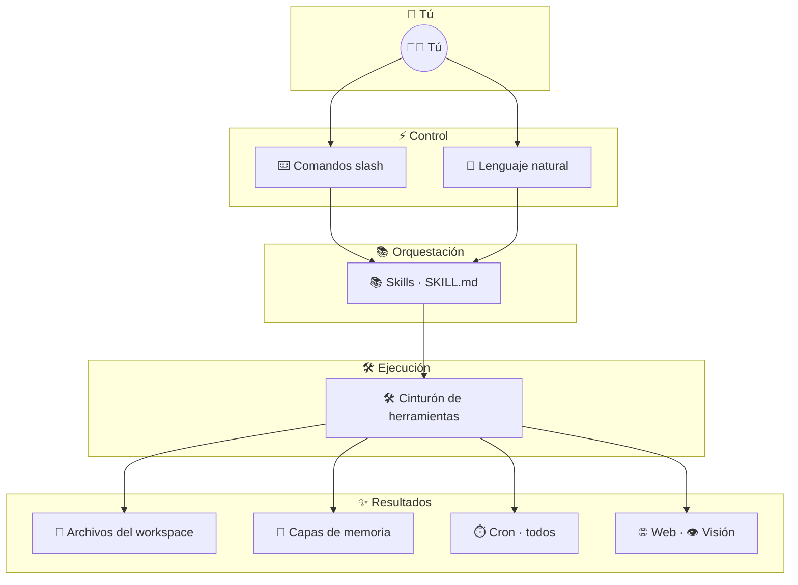
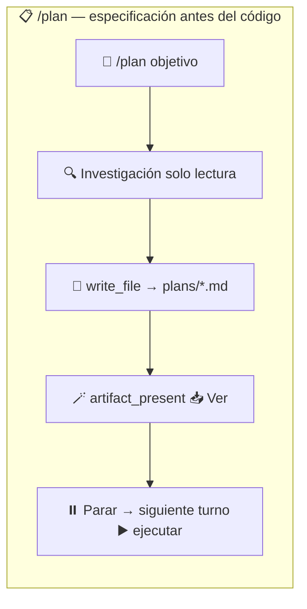
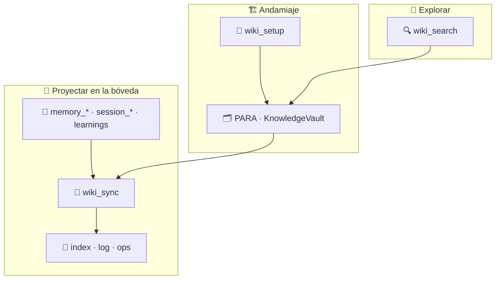
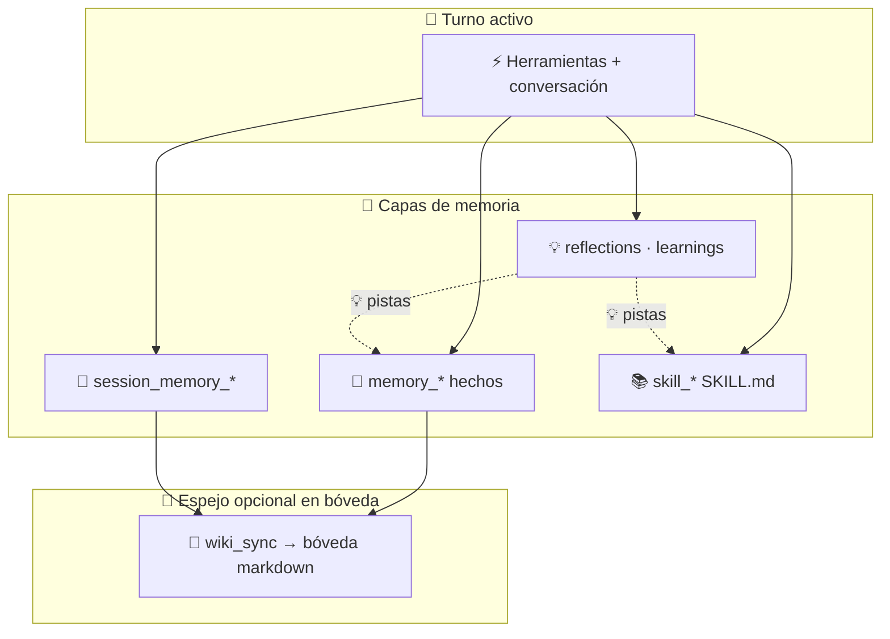

<div align="center">

# Web Agent

**Agente de IA nativo del navegador con espacios de trabajo aislados, memoria persistente y cero fricción de configuración.**

[Demo en vivo](https://webagent.aratech.ae) · [GitHub](https://github.com/nikola66/web-agent) · [Apoya en Ko-fi](http://ko-fi.com/nikola66) · [Contribuir](CONTRIBUTING.es.md) · [Seguridad](SECURITY.md)

**Idiomas:** [English](README.md) · [Español](README.es.md) · [简体中文](README.zh-CN.md) · [Deutsch](README.de.md)

</div>

<table>
  <tr>
    <td></td>
    <td></td>
    <td></td>
    <td></td>
    <td></td>
  </tr>
</table>

Web Agent es un agente de IA de código abierto que se ejecuta directamente en el navegador sobre WebContainers. No hay nada que instalar para usarlo: sin Docker, sin VPS, sin VM, sin Mac mini, sin caja Hostinger, sin stack local de Python. Abre la app, lanza un perfil y empieza a trabajar.

Está diseñado para sentirse simple para usuarios finales y capaz para usuarios avanzados: perfiles aislados, persistencia local en el navegador, herramientas, skills, sesiones, reflexiones, aprendizajes, trabajos cron, **modo de planificación** (`/plan`), una **bóveda de conocimiento estilo PARA + Obsidian** (herramientas `wiki_*` y comandos `/wiki-*`), y un runtime auto-mejorante que permanece en la máquina del usuario.

## Contenido

- [Por qué Web Agent](#por-qué-web-agent)
- [Inicio rápido](#inicio-rápido)
- [Destacados](#destacados)
- [Cómo funciona](#cómo-funciona)
- [Comandos slash](#comandos-slash)
- [Configuración y proveedores](#configuración-y-proveedores)
- [Herramientas](#herramientas)
- [Skills](#skills)
- [Funciones del espacio de trabajo](#funciones-del-espacio-de-trabajo)
- [Persistencia y alojamiento](#cómo-funciona-la-persistencia)
- [Desarrollo](#desarrollo)
- [Arquitectura en un vistazo](#arquitectura-en-un-vistazo)
- [Privacidad y seguridad](#privacidad-y-seguridad)
- [Contribuir](#contribuir)

## Por qué Web Agent

- **Clic y listo**. Se lanza desde el navegador sin paso de instalación para usuarios finales.
- **Aislado por defecto**. Cada perfil obtiene su propio espacio de trabajo, memoria y estado del runtime.
- **Autoaprendizaje**. Skills, reflexiones, aprendizajes, hechos, memoria de sesión y proyecciones wiki opcionales ayudan al agente a mejorar con el tiempo sin perder el control local en el navegador.
- **Persistencia local primero**. Espacios de trabajo, memoria, sesiones y skills viven en el almacenamiento del navegador y pueden exportarse o reimportarse más tarde.
- **Alojado sin estado de usuario en el servidor**. La demo alojada sirve la app, mientras que los archivos del usuario y el estado del agente permanecen en el navegador.
- **Juez de turno diminuto**. Un sidecar ONNX ligero clasifica continue/stop/ask_user para que el runtime evite orquestación frágil basada en regex; la seguridad determinista permanece en `turn.ts`.
- **Código abierto**. Gratis para usar, bifurcar, modificar y distribuir bajo la Licencia MIT.

## Destacados

- Runtime Node.js nativo del navegador impulsado por WebContainers
- Perfiles aislados con espacios de trabajo y memorias separados
- Herramientas integradas para archivos, shell, búsqueda, fetch, memoria, sesiones, cron, skills y **bóveda de conocimiento** (`wiki_setup`, `wiki_sync`, `wiki_search`)
- **Modo de planificación `/plan`**: investiga el espacio de trabajo, guarda un plan markdown fechado bajo `plans/`, lo presenta con `artifact_present`, y luego ejecuta en un **mensaje de seguimiento**
- **`/wiki_setup` · `/wiki_sync` · `/wiki_search`**: atajos deterministas que enrutan a las herramientas wiki (raíz de bóveda por defecto: `.webagent/knowledge-vault/`)
- Almacén persistente de hechos, memoria de sesión continua, reflexiones y aprendizajes
- Subidas al espacio de trabajo en vivo con transferencia de imágenes a herramientas de visión
- Claves API cifradas almacenadas localmente en el navegador
- Flujos de exportación e importación para espacios de trabajo de larga duración en el navegador
- Demo alojada para prueba sin fricción
- **Sidecar turn judge** (`server/turn-judge`): Fastify + ONNX para stop/continue/ask_user sin pilas de control basadas en regex

## Inicio rápido

Elige una ruta:

| Ruta | Ideal para |
| --- | --- |
| [Demo alojada](#usa-la-demo-alojada) | Cero instalación — abre la app y añade una clave API |
| [Desarrollo local](#ejecutar-localmente) | Contribuidores, builds personalizados o uso sin conexión |

### Usa la demo alojada

Abre [webagent.aratech.ae](https://webagent.aratech.ae), crea o selecciona un perfil, añade una clave gratuita de [OpenRouter.ai](https://openrouter.ai) o [Ollama](https://ollama.com), haz clic en **Launch**, y empieza a chatear.

`Gemma4` es un buen valor por defecto en OpenRouter (velocidad, precio, tool calling, multimodal). Cualquier modelo compatible funciona.

### Ejecutar localmente

```bash
git clone https://github.com/nikola66/web-agent.git
cd web-agent
git lfs install
git lfs pull
npm install
npm run dev
```

Abre `http://localhost:5173`. Python solo es necesario para reentrenar el turn judge; el modelo ONNX incluido vive bajo `models/turn-judge/`. Consulta [docs/turn-judge.md](docs/turn-judge.md).

## Cómo funciona

Web Agent no es solo una caja de chat. Es un runtime de agente nativo del navegador con tres capas trabajando juntas:

- `⌨️ Comandos slash` para control rápido del operador
- `🛠️ Herramientas` para acciones concretas en el espacio de trabajo y en la web
- `📚 Skills` para procedimientos reutilizables y comportamiento de nivel superior



### Planificación, bóveda wiki y autoaprendizaje

Estos tres bucles se sitúan junto al diagrama principal de capacidades: la **planificación** produce especificaciones revisables antes de la implementación; la **wiki** refleja la memoria del runtime en markdown navegable (compatible con Obsidian); el **autoaprendizaje** une hechos, notas de sesión, skills y reflexiones a lo largo del tiempo.

#### Planificación (`/plan`)



#### Bóveda de conocimiento (`wiki_*` / `/wiki_*`)



#### Bucle de autoaprendizaje



Para elegir **hechos vs sesión vs skills vs bóveda**, usa el skill incluido **`/memory-layers`**.

### Mapa rápido de capacidades

| Área | Qué contiene | Qué habilita |
| --- | --- | --- |
| `⌨️ Comandos` | Controles de sesión como `/help`, `/compact`, `/plan`, `/checkpoint`, `/wiki_*` | Navegación más rápida, recuperación, planificación, operaciones de bóveda y control del operador |
| `🛠️ Herramientas de espacio de trabajo` | Leer, escribir, editar, diff, mover, buscar, shell | Trabajo real dentro de un espacio de trabajo de proyecto aislado |
| `🧠 Herramientas de memoria` | Hechos, notas de sesión, recuperación de conversación | Contexto persistente que mejora la continuidad |
| `📓 Herramientas wiki` | `wiki_setup`, `wiki_sync`, `wiki_search` | Bóveda markdown con forma PARA y búsqueda cuando las herramientas de memoria no bastan |
| `📋 Planificación` | `/plan` + `write_file` en `plans/` + `artifact_present` | Flujos spec-first: planificar ahora, implementar en el siguiente turno |
| `⏱️ Herramientas de automatización` | Trabajos cron heartbeat y todos | Tareas recurrentes mientras la app está abierta |
| `🌐 Herramientas remotas` | Búsqueda, fetch, email, visión, transcripción de YouTube | Ejecución de tareas con conciencia web y multimodal |
| `📚 Skills` | Procedimientos reutilizables `SKILL.md` | Flujos de trabajo de nivel superior sin reentrenar el modelo |

## Comandos slash

Estos comandos hacen que la experiencia de terminal se sienta como una consola de operador en lugar de un chatbot simple. Cubren ayuda, interrupción, compactación de contexto, **modo de planificación**, atajos de **bóveda wiki**, recuperación basada en checkpoints e invocación directa de skills.

| Comando | Qué hace |
| --- | --- |
| `/help` | Muestra comandos integrados y herramientas disponibles. |
| `/clear` | Limpia el historial de conversación para un hilo nuevo; mantiene la identidad del agente y del usuario. |
| `/compact` | Resume el contexto antiguo y mantiene el hilo actual en marcha. |
| `/plan [goal]` | **Modo de planificación:** investiga el espacio de trabajo con herramientas de solo lectura, escribe el markdown completo del plan bajo `plans/`, lo presenta vía `artifact_present`, y luego **para** — responde en el **siguiente** turno con "execute the plan" (o ediciones) para implementar. |
| `/checkpoint [name]` | Guarda una instantánea con nombre del historial actual para rollback. |
| `/rollback [name]` | Lista checkpoints o restaura un checkpoint con nombre. |
| `/skills [search]` | Lista skills instalados, o busca skills por consulta. |
| `/wiki_setup [path]` | Inicializa el andamiaje PARA + wiki (`Projects/`, `Areas/`, `Resources/KnowledgeVault/…`, `Archives/`). Raíz opcional relativa al espacio de trabajo; por defecto **`.webagent/knowledge-vault`**. Los espacios de trabajo que aún usan la carpeta de bóveda antigua **`knowledge-vault/`** se reubican automáticamente en la siguiente operación wiki que omita `root_path`. |
| `/wiki_sync [scope] [path]` | Empuja proyecciones del runtime a la bóveda: **`facts`**, **`session`**, o **`all`** (incluye learnings). Ruta opcional después de `scope`. Requiere `wiki_setup` primero. |
| `/wiki_search <query>` | Busca markdown bajo la bóveda wiki (resultados ordenados + fragmentos). |
| `/<skill> [task]` | Invoca un skill instalado para una tarea. |
| `/stop` | Interrumpe la ejecución actual. |
| `/exit` | Sale de la sesión activa del agente en terminal. |

> `📌 Consejo:` Usa `/skills` para descubrir capacidades, luego salta directamente a un flujo de trabajo con `/<skill-slug> [task]`.

> `📌 Consejo:` Peticiones en lenguaje natural como "set up my knowledge vault" o "sync facts to the wiki" se mapean a las mismas herramientas **`wiki_*`** que los comandos slash `/wiki_*`.

## Configuración y proveedores

Web Agent expone la configuración de proveedores en dos lugares: el editor de perfil para el proveedor de chat/modelo activo, y la barra lateral de Settings para herramientas web enrutadas por el navegador y entrega de email.

### Proveedores de modelos

Cada perfil puede elegir su propio proveedor, anulación opcional de modelo, clave API y personalidad. Los proveedores de perfil integrados actuales son:

| Proveedor | Tipo | Notas |
| --- | --- | --- |
| `OpenRouter` | Enrutador de modelos alojado | Proveedor por defecto con amplio acceso a modelos con una sola clave. |
| `Ollama (cloud)` | Proveedor compatible con OpenAI alojado | Usa la API en la nube de Ollama en lugar de un daemon local. |
| `Custom (OpenAI-compatible)` | Trae tu propio endpoint | Soporta una URL base personalizada y clave API para proveedores compatibles con `/v1`. |

### Proveedores de herramientas del navegador

Estos impulsan acciones web integradas desde el panel de Settings:

| Proveedor | Impulsa | Notas |
| --- | --- | --- |
| `TinyFish` | `web_search`, `web_fetch` | Proveedor de herramientas del navegador por defecto configurado en Settings. |
| `Resend` | `email` | Usado para email saliente con una dirección de remitente verificada. |

### Qué puedes configurar

- `🧠 Proveedor de modelo por perfil`: elige el backend de modelo para cada perfil de agente.
- `🔧 Anulación de modelo`: establece un modelo específico en lugar del predeterminado del proveedor.
- `🔐 Clave API por perfil`: almacena credenciales separadas de otros perfiles.
- `🌐 URL base personalizada`: apunta el proveedor personalizado a cualquier endpoint compatible con OpenAI.
- `✉️ Entrega de email`: añade credenciales de Resend para flujos de digest o correo saliente.

## Herramientas

Web Agent incluye un amplio cinturón de herramientas nativas. Las integradas cubren manipulación del espacio de trabajo, búsqueda, memoria, automatización, gestión de skills y acciones remotas enrutadas por el navegador.

### Grupos de herramientas

| Grupo | Incluye | Ideal para |
| --- | --- | --- |
| `📁 Archivos y espacio de trabajo` | `read_file`, `write_file`, `edit_file`, `multi_edit`, `move_file`, `delete_file`, `tree`, `list_dir`, `find_files`, `grep`, `file_diff`, `file_stat`, `make_dir` | Construir, editar, inspeccionar y organizar archivos de proyecto |
| `🧠 Memoria y recuperación` | `memory_save`, `memory_recall`, `memory_search`, `session_memory_append`, `session_memory_list`, `session_search` | Hechos de larga duración, notas continuas y recuperar contexto previo |
| `📓 Wiki de conocimiento` | `wiki_setup`, `wiki_sync`, `wiki_search` | Bóveda PARA + compatible con Obsidian bajo el espacio de trabajo; proyecta hechos/sesión/learnings a markdown; búsqueda de texto completo en la bóveda |
| `📚 Skills` | `skill_list`, `skill_view`, `skill_save`, `skill_manage`, `skill_bulk_save`, `skill_delete`, `skill_recall` | Descubrir, leer, crear, importar y mantener skills |
| `⏱️ Automatización` | `cron_register`, `cron_list`, `todo_write` | Trabajos recurrentes, flujos impulsados por heartbeat y listas de verificación |
| `🌐 Remoto y multimodal` | `web_search`, `web_fetch`, `vision_analyze`, `youtube_transcribe`, `email` | Investigación, obtención de contenido en vivo, análisis de imágenes, transcripciones y entrega saliente |
| `🖥️ Sistema y salida` | `run_shell`, `system_info`, `artifact_present`, `apply_patch` | Ejecutar comandos, comprobar estado del entorno, presentar artefactos y parches quirúrgicos |

<details>
<summary><strong>🛠️ Catálogo completo de herramientas</strong></summary>

| Herramienta | Qué hace |
| --- | --- |
| `🩹 apply_patch` | Aplica operaciones de parche unificado para cambios quirúrgicos en archivos. |
| `🪄 artifact_present` | Presenta markdown al host del navegador con opciones de ver o descargar. |
| `📋 cron_list` | Lista trabajos cron heartbeat desde `.cronjobs.json`. |
| `⏱️ cron_register` | Registra trabajos heartbeat recurrentes que se ejecutan mientras la pestaña de la app está abierta. |
| `🗑️ delete_file` | Elimina un archivo del espacio de trabajo. |
| `🛠️ edit_file` | Reemplaza un fragmento coincidente o reemplaza completamente el contenido del archivo. |
| `✉️ email` | Envía email saliente a través de la entrega configurada con Resend. |
| `🧾 file_diff` | Muestra un diff orientado a líneas entre dos archivos UTF-8 del espacio de trabajo. |
| `📌 file_stat` | Devuelve metadatos del sistema de archivos para una ruta del espacio de trabajo. |
| `🔎 find_files` | Encuentra archivos por patrones de nombre tipo glob. |
| `🔍 grep` | Busca contenido de archivos por texto o regex. |
| `📁 list_dir` | Lista archivos y directorios del espacio de trabajo con recursión y filtrado opcionales. |
| `📂 make_dir` | Crea directorios recursivamente dentro del espacio de trabajo. |
| `🧠 memory_recall` | Recupera un hecho de memoria guardado por clave exacta. |
| `💾 memory_save` | Guarda un hecho de memoria duradero bajo una clave estable. |
| `🔮 memory_search` | Busca hechos de memoria guardados por subcadena. |
| `📦 move_file` | Mueve o renombra una ruta del espacio de trabajo. |
| `🛠️ multi_edit` | Aplica múltiples ediciones de buscar y reemplazar en un archivo. |
| `📄 read_file` | Lee un archivo UTF-8 del espacio de trabajo. |
| `🖥️ run_shell` | Ejecuta un comando shell en el runtime del espacio de trabajo. |
| `📝 session_memory_append` | Añade una nota ligera a la memoria de sesión continua. |
| `🗂️ session_memory_list` | Lee las entradas más recientes de la memoria de sesión continua. |
| `📇 session_search` | Busca conversaciones archivadas del espacio de trabajo por palabras clave. |
| `📚 skill_bulk_save` | Importa o guarda múltiples skills en lote en una operación. |
| `🗑️ skill_delete` | Elimina un skill guardado de la biblioteca del espacio de trabajo. |
| `📋 skill_list` | Busca y lista skills guardados. |
| `🧠 skill_manage` | Crea, parchea, edita, elimina, importa o gestiona skills reutilizables. |
| `🔍 skill_recall` | Carga un `SKILL.md` sin procesar por nombre para compatibilidad hacia atrás. |
| `📚 skill_save` | Guarda un procedimiento reutilizable `SKILL.md` inmediatamente. |
| `📖 skill_view` | Carga el `SKILL.md` completo de un skill o un archivo de soporte permitido. |
| `📟 system_info` | Devuelve una instantánea segura del sistema incluyendo hora, zona horaria, uptime y memoria. |
| `✅ todo_write` | Crea o actualiza todos estilo lista de verificación. |
| `🌲 tree` | Renderiza una vista de árbol de directorios acotada. |
| `🖼️ vision_analyze` | Analiza una imagen con el modelo de visión configurado. |
| `🌐 web_fetch` | Obtiene y resume contenido de una URL. |
| `🔍 web_search` | Busca en la web y devuelve resultados ordenados. |
| `📓 wiki_search` | Busca archivos markdown bajo la raíz de la bóveda wiki; fragmentos ordenados cuando `memory_search` no basta. |
| `📓 wiki_setup` | Crea el andamiaje PARA + `Resources/KnowledgeVault/` (idempotente). |
| `🔄 wiki_sync` | Actualiza `index.md` / `log.md` de la bóveda y escribe `ops/wiki-sync-*.md` desde hechos, cola de sesión y/o learnings. |
| `✍️ write_file` | Escribe texto en un archivo y crea carpetas padre según sea necesario. |
| `📹 youtube_transcribe` | Obtiene una transcripción completa de YouTube con marcas de tiempo. |

</details>

## Skills

Los skills son procedimientos reutilizables almacenados como archivos `SKILL.md`. Permiten a Web Agent pasar del uso crudo de herramientas a flujos de trabajo estructurados que pueden invocarse bajo demanda.

### Skills incluidos

| Comando slash | Nombre | Para qué sirve | Etiquetas |
| --- | --- | --- | --- |
| `/clarify` | Clarify | Emite un bloque de aclaración estructurado cuando la intención del usuario es ambigua, para que la UI pueda presentar opciones en lugar de adivinar. | `ux`, `ambiguity`, `clarification`, `dialog` |
| `/project-scaffold` | Project Scaffold | Crea una carpeta de espacio de trabajo aislada para una nueva app, demo, spike, sandbox o test harness antes de que comience la generación de archivos. | `project`, `scaffold`, `verification` |
| `/research-pack` | Research Pack | Ejecuta flujos de investigación académica usando herramientas web existentes como rutas de arXiv y Semantic Scholar. | `research`, `papers`, `citations`, `academic`, `arxiv`, `semantic-scholar` |
| `/systematic-debugging` | Systematic Debugging | Usa un bucle ligero de hipótesis y experimento para bugs y comportamiento inestable. | `debugging`, `reliability`, `investigation`, `science` |
| `/memory-layers` | Memory Layers | Elige la capa correcta entre hechos, notas de sesión, skills y proyecciones wiki — evita contexto almacenado duplicado o contradictorio. | `memory`, `session`, `skills`, `facts`, `context` |
| `/web-agent-skill` | Web Agent Skill | Evoluciona Web Agent de forma segura usando su runtime, capas de memoria, cron, skills incluidos y la verdad del repositorio. | `web-agent`, `self-evolution`, `maintenance`, `skills`, `memory`, `cron` |

Skills adicionales incluidos aparecen bajo `/skills`; la tabla anterior destaca puntos de partida comunes.

### Por qué importan los skills

- `🧩 Reutilizables`: un buen flujo de trabajo solo necesita escribirse una vez.
- `🛡️ Más seguros`: los skills codifican patrones preferidos antes de que el agente empiece a cambiar archivos.
- `⚡ Más rápidos`: `/skill-slug [task]` es más rápido que reexplicar un flujo de trabajo en cada sesión.
- `🧠 Enseñables`: los usuarios pueden hacer crecer al agente guardando nuevos procedimientos directamente en el espacio de trabajo.

### Wiki vs memoria (breve)

- **`memory_*` / `session_*`** contienen el contexto estructurado canónico que usa el runtime.
- **`wiki_sync`** proyecta resúmenes y marcadores de sincronización a markdown para humanos (u Obsidian); trata la bóveda como un **espejo navegable**, no una segunda fuente de verdad, a menos que archives prosa allí intencionalmente.

## Funciones del espacio de trabajo

Cada perfil obtiene su propio espacio de trabajo aislado enraizado en el almacenamiento del navegador. La capa de espacio de trabajo está diseñada para sentirse como un entorno de proyecto ligero, no solo un bucket de adjuntos.

| Función | Qué significa |
| --- | --- |
| `📁 Aislado por perfil` | Cada perfil de agente obtiene su propio espacio de trabajo y estado del runtime. |
| `💾 Instantáneas persistentes` | Los archivos sobreviven a recargas usando persistencia del lado del navegador. |
| `📤 Exportar / Importar` | La pestaña Workspaces puede exportar una instantánea del perfil a JSON e importarla más tarde. |
| `🖼️ Transferencia de subidas` | Los archivos subidos llegan al espacio de trabajo en vivo, incluyendo rutas de imagen para herramientas de visión. |
| `🧰 Operaciones de archivos` | Herramientas de leer, escribir, editar, diff, mover, eliminar, listar, grep y tree operan dentro del espacio de trabajo. |
| `🖥️ Acceso shell en vivo` | El runtime puede ejecutar comandos soportados del espacio de trabajo en el entorno Node nativo del navegador. |
| `📋 Planes guardados` | `/plan` escribe markdown con marca de tiempo bajo **`plans/`** (relativo al espacio de trabajo; `.webagent/plans/` legado sigue siendo legible). |
| `📓 Bóveda de conocimiento` | Árbol PARA por defecto **`.webagent/knowledge-vault/`** con **`Resources/KnowledgeVault/`** para wikilinks, logs y archivos de detalle ops después de `wiki_sync`. Los árboles antiguos **`knowledge-vault/`** migran automáticamente cuando usas rutas wiki por defecto. |
| `🧹 Reinicio limpio` | Destruye un espacio de trabajo de un solo perfil o borra todo el estado local del agente desde la barra lateral. |
| `📊 Visibilidad de almacenamiento` | La pestaña Workspaces muestra el uso y la cuota del almacenamiento del navegador. |

### UX del espacio de trabajo

- `Pestaña Workspaces`: exportar, importar, destruir e inspeccionar el uso del almacenamiento del navegador para el perfil activo.
- `Popup Files`: navega el `/workspace` en vivo, previsualiza archivos e interactúa con el árbol de trabajo.
- `uploads/`: los activos subidos por el usuario se normalizan bajo `uploads/` para acceso seguro de herramientas.

## Cómo funciona la persistencia

Web Agent mantiene el estado del usuario en el almacenamiento del navegador en la máquina del usuario. Eso incluye espacios de trabajo, sesiones, memoria, hechos, aprendizajes, skills, todos, metadatos cron, markdown **`/plan`** guardado bajo **`plans/`** (las rutas legadas `.webagent/plans/` siguen siendo legibles), archivos de bóveda wiki bajo **`.webagent/knowledge-vault/`** por defecto (la **`knowledge-vault/`** legada en la raíz del espacio de trabajo se mueve automáticamente allí cuando las herramientas wiki se ejecutan sin un `root_path` explícito), y credenciales locales. Nada de ese estado persistente del agente está pensado para vivir en el servidor.

Mientras el navegador conserve su almacenamiento local y datos OPFS, el agente mantiene su historial y espacio de trabajo. Cuando quieras portabilidad, exporta el espacio de trabajo o el estado local del navegador e impórtalo más tarde en la misma máquina u otra.

Para despliegues alojados, el encuadre más seguro es:

- **La app puede alojarse en cualquier lugar**
- **El estado del agente vive en el navegador**
- **El servidor solo debe entregar la app y retransmitir solicitudes upstream permitidas cuando sea necesario**

**Autoalojamiento (Railpack / Dokploy):** Usa el `railpack.json` del repo para `deploy.startCommand` (`scripts/start-with-proxy.sh`) y `deploy.aptPackages` (extiende los predeterminados con `caddy`). No añadas un script `start` en `package.json` para esto: Railpack lo trata como comando de inicio personalizado, omite la ruta integrada de imagen estática+Caddy, y la configuración del sidecar se rompe. El `Caddyfile` incluido coincide con **Caddy apt de Debian (~2.6)** (sin bloque `persist_config` o `trusted_proxies` global). `web_fetch` / `web_search` sin TinyFish dependen del pequeño listener Node en `scripts/cors-proxy-server.mjs` (predeterminado `127.0.0.1:8799`).

**Turn judge:** Un modelo ONNX preentrenado se incluye en `models/turn-judge/` (usa `git lfs pull` después del clone). `npm run dev` inicia el judge con la app (puerto `8787`). El `scripts/start-with-proxy.sh` de producción inicia el sidecar compilado después de `npm run build`. Establece `WEBAGENT_TURN_JUDGE=0` solo para deshabilitar. Configuración completa, verificación y reentrenamiento opcional: [docs/turn-judge.md](docs/turn-judge.md).

## Desarrollo

```bash
npm run dev
npm run build
npm run test
npm run judge:test
npm run test:browser
```

Turn judge (reentrenamiento opcional): edita `data/turn-judge/*.jsonl`, luego `npm run judge:train`.

Documentación para contribuidores:

- [CONTRIBUTING.es.md](CONTRIBUTING.es.md)
- [AGENTS.md](AGENTS.md) — reglas para agentes de codificación IA
- [CAPABILITIES.md](CAPABILITIES.md)
- [docs/ARCHITECTURE.es.md](docs/ARCHITECTURE.es.md) — mapa del sistema, protocolo IPC, capas de almacenamiento
- [docs/turn-judge.md](docs/turn-judge.md) — despliegue, verificación y reentrenamiento del sidecar judge
- [docs/agent-notes.md](docs/agent-notes.md)
- [docs/testing-checklist.md](docs/testing-checklist.md)

## Arquitectura en un vistazo

- **Frontend**: React + Vite + xterm.js
- **Runtime**: Node.js dentro de WebContainers
- **Persistencia**: IndexedDB + OPFS en el navegador
- **Aislamiento**: espacios de trabajo y estado del runtime por perfil
- **Acceso a modelos**: OpenRouter o proveedores compatibles con OpenAI
- **Turn judge**: clasificador ONNX `server/turn-judge` para continue/stop/ask_user (la seguridad determinista permanece en `turn.ts`)
- **Planes y bóveda**: planes con marca de tiempo bajo `plans/` (`.webagent/plans/` legado legible); árbol wiki PARA (predeterminado `.webagent/knowledge-vault/`) sincronizado vía herramientas `wiki_*`

El runtime del agente está embebido en la app del navegador, montado en un espacio de trabajo en vivo, y lanzado dentro de un entorno Node respaldado por terminal. Los perfiles mantienen personalidades, configuración, estado del espacio de trabajo y memoria separados.

## Privacidad y seguridad

- Archivos del espacio de trabajo, sesiones, memoria, skills y credenciales locales permanecen del lado del navegador.
- Las claves API se almacenan localmente y se cifran antes de la persistencia.
- Los perfiles están aislados unos de otros.
- El modo alojado debe permanecer solo de tránsito para solicitudes upstream, no un backend de persistencia para el estado del usuario.

Consulta [SECURITY.md](SECURITY.md) para detalles de reporte y postura de seguridad.

## Código abierto

Web Agent es un proyecto de código abierto. Eres libre de usarlo, bifurcarlo, modificarlo y distribuirlo bajo la [Licencia MIT](LICENSE).

Inspirado por OpenClaw, [Hermes Agent](https://github.com/NousResearch/hermes-agent) y OpenCrabs.

Agradecimiento especial a la tecnología Nodebox utilizada y al proyecto de código abierto detrás de ella. Es un software hermoso e hizo posible Web Agent.

## Apoyo y patrocinio

Si Web Agent te ahorra tiempo o ayuda en tu trabajo, apoya el desarrollo continuo en [Ko-fi](http://ko-fi.com/nikola66). El patrocinio ayuda a financiar el mantenimiento continuo, nuevas capacidades, pulido de UI y mejoras a largo plazo.

<table>
  <tr>
    <td align="center"><a href="http://ko-fi.com/nikola66">Apoya en Ko-fi</a></td>
    <td align="center"><a href="https://github.com/nikola66/web-agent">Estrella en GitHub</a></td>
  </tr>
</table>

### Patrocina este proyecto

<table>
  <tr>
    <td align="center"><br />Patrocinar proyecto<br />Colocar logo aquí</td>
    <td align="center"><br />Patrocinar proyecto<br />Colocar logo aquí</td>
    <td align="center"><br />Patrocinar proyecto<br />Colocar logo aquí</td>
  </tr>
</table>

## Contribuir

Issues y pull requests son bienvenidos. Empieza con [CONTRIBUTING.es.md](CONTRIBUTING.es.md), mantén los cambios quirúrgicos, y prefiere correcciones que preserven el diseño nativo del navegador y local-first del proyecto.

## Licencia

MIT. Consulta [LICENSE](LICENSE).
