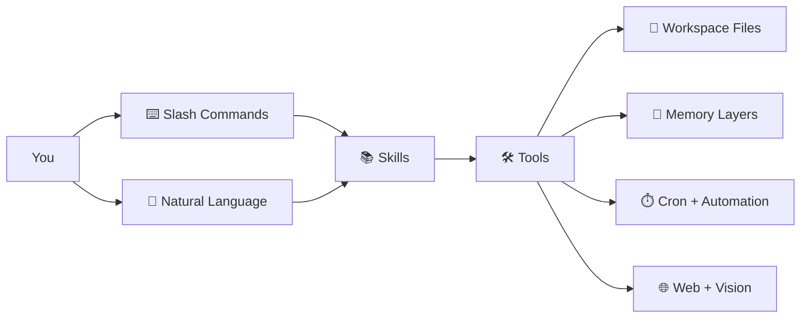

<div align="center">

# Web Agent

**Browser-native AI agent with isolated workspaces, persistent memory, and zero setup friction.**

[Live demo](https://webagent.aratech.ae) · [GitHub](https://github.com/nikola66/web-agent) · [Support on Ko-fi](http://ko-fi.com/nikola66) · [Contributing](CONTRIBUTING.md) · [Security](SECURITY.md)

</div>

<table>
  <tr>
    <td></td>
    <td></td>
    <td></td>
    <td></td>
    <td></td>
  </tr>
</table>

Web Agent is an open-source AI agent that runs directly in the browser on top of WebContainers. There is nothing to install to use it: no Docker, no VPS, no VM, no Mac mini, no Hostinger box, no local Python stack. Open the app, launch a profile, and start working.

It is designed to feel simple for end users and capable for power users: isolated profiles, browser-local persistence, tools, skills, sessions, reflections, learnings, cron jobs, and a self-improving runtime that stays on the user’s machine.

## Why Web Agent

- **Click and run**. Launch from the browser with no install step for end users.
- **Isolated by default**. Every profile gets its own workspace, memory, and runtime state.
- **Self-learning**. Skills, reflections, learnings, facts, and session memory help the agent improve over time.
- **Local-first persistence**. Workspaces, memory, sessions, and skills live in browser storage and can be exported or re-imported later.
- **Hosted without server-side user state**. The hosted demo serves the app, while user files and agent state stay in the browser.
- **Open source**. Free to use, fork, modify, and distribute under the MIT License.

## Highlights

- Browser-native Node.js runtime powered by WebContainers
- Isolated profiles with separate workspaces and memories
- Built-in tools for files, shell, search, fetch, memory, sessions, cron, and skills
- Persistent fact store, rolling session memory, reflections, and learnings
- Uploads into the live workspace with image handoff to vision tools
- Encrypted API keys stored locally in the browser
- Export and import flows for long-lived browser-local workspaces
- Hosted demo for zero-friction trial usage

## Capability Surface

Web Agent is not just a chat box. It is a browser-native agent runtime with three layers working together:

- `⌨️ Slash commands` for fast operator control
- `🛠️ Tools` for concrete actions in the workspace and on the web
- `📚 Skills` for reusable procedures and higher-level behavior



### Quick Capability Map

| Area | What lives there | What it enables |
| --- | --- | --- |
| `⌨️ Commands` | Session controls like `/help`, `/compact`, `/checkpoint` | Faster navigation, recovery, and operator control |
| `🛠️ Workspace tools` | Read, write, edit, diff, move, search, shell | Real work inside an isolated project workspace |
| `🧠 Memory tools` | Facts, session notes, conversation recall | Persistent context that improves continuity |
| `⏱️ Automation tools` | Heartbeat cron jobs and todos | Recurring tasks while the app is open |
| `🌐 Remote tools` | Search, fetch, email, vision, YouTube transcript | Web-aware and multimodal task execution |
| `📚 Skills` | Reusable `SKILL.md` procedures | Higher-level workflows without retraining the model |

## Slash Commands

These commands make the terminal experience feel like an operator console rather than a plain chatbot. They cover help, interruption, context compaction, checkpoint-based recovery, and direct skill invocation.

| Command | What it does |
| --- | --- |
| `/help` | Show built-in commands and available tools. |
| `/clear` | Clear history and restart onboarding for this profile. |
| `/compact` | Summarize older context and keep the current thread going. |
| `/checkpoint [name]` | Save a named snapshot of current history for rollback. |
| `/rollback [name]` | List checkpoints or restore a named checkpoint. |
| `/skills [search]` | List installed skills, or search skills by query. |
| `/<skill> [task]` | Invoke an installed skill for a task. |
| `/stop` | Interrupt the current run. |
| `/exit` | Exit the active terminal agent session. |

> `📌 Tip:` Use `/skills` to discover capabilities, then jump straight into a workflow with `/<skill-slug> [task]`.

## Settings And Providers

Web Agent exposes provider configuration in two places: the profile editor for the active chat/model provider, and the Settings sidebar for browser-routed web tools and email delivery.

### Model Providers

Each profile can choose its own provider, optional model override, API key, and personality. Current built-in profile providers are:

| Provider | Type | Notes |
| --- | --- | --- |
| `OpenRouter` | Hosted model router | Default provider with broad model access through one key. |
| `Ollama (cloud)` | Hosted OpenAI-compatible provider | Uses Ollama's cloud API rather than a local daemon. |
| `Custom (OpenAI-compatible)` | Bring-your-own endpoint | Supports a custom base URL and API key for compatible `/v1` providers. |

### Browser Tool Providers

These power built-in web actions from the Settings panel:

| Provider | Powers | Notes |
| --- | --- | --- |
| `TinyFish` | `web_search`, `web_fetch` | Default browser-tool provider configured in Settings. |
| `Resend` | `email` | Used for outbound email with a verified sender address. |

### What You Can Configure

- `🧠 Per-profile model provider`: choose the model backend for each agent profile.
- `🔧 Model override`: set a specific model instead of the provider default.
- `🔐 Per-profile API key`: store credentials separately from other profiles.
- `🌐 Custom base URL`: point the custom provider at any OpenAI-compatible endpoint.
- `✉️ Email delivery`: add Resend credentials for digest or outbound mail flows.

## Tooling

Web Agent ships with a broad native tool belt. The built-ins cover workspace manipulation, search, memory, automation, skill management, and browser-routed remote actions.

### Tool Groups

| Group | Includes | Best for |
| --- | --- | --- |
| `📁 Files & Workspace` | `read_file`, `write_file`, `edit_file`, `multi_edit`, `move_file`, `delete_file`, `tree`, `list_dir`, `find_files`, `grep`, `file_diff`, `file_stat`, `make_dir` | Building, editing, inspecting, and organizing project files |
| `🧠 Memory & Recall` | `memory_save`, `memory_recall`, `memory_search`, `session_memory_append`, `session_memory_list`, `session_search` | Long-lived facts, rolling notes, and recovering prior context |
| `📚 Skills` | `skill_list`, `skill_view`, `skill_save`, `skill_manage`, `skill_bulk_save`, `skill_delete`, `skill_recall` | Discovering, reading, creating, importing, and maintaining skills |
| `⏱️ Automation` | `cron_register`, `cron_list`, `todo_write` | Recurring jobs, heartbeat-driven workflows, and checklists |
| `🌐 Remote & Multimodal` | `web_search`, `web_fetch`, `vision_analyze`, `youtube_transcribe`, `email` | Research, fetching live content, image analysis, transcripts, and outbound delivery |
| `🖥️ System & Output` | `run_shell`, `system_info`, `artifact_present`, `apply_patch` | Executing commands, checking environment state, presenting artifacts, and surgical patching |

<details>
<summary><strong>🛠️ Full tool catalog</strong></summary>

| Tool | What it does |
| --- | --- |
| `🩹 apply_patch` | Apply unified patch operations for surgical file changes. |
| `🪄 artifact_present` | Present markdown to the browser host with view or download affordances. |
| `📋 cron_list` | List heartbeat cron jobs from `.cronjobs.json`. |
| `⏱️ cron_register` | Register recurring heartbeat jobs that run while the app tab is open. |
| `🗑️ delete_file` | Delete a file from the workspace. |
| `🛠️ edit_file` | Replace a matching snippet or fully replace file contents. |
| `✉️ email` | Send outbound email through Resend-configured delivery. |
| `🧾 file_diff` | Show a line-oriented diff between two UTF-8 workspace files. |
| `📌 file_stat` | Return filesystem metadata for a workspace path. |
| `🔎 find_files` | Find files by glob-like name patterns. |
| `🔍 grep` | Search file contents by text or regex. |
| `📁 list_dir` | List workspace files and directories with optional recursion and filtering. |
| `📂 make_dir` | Create directories recursively inside the workspace. |
| `🧠 memory_recall` | Recall a saved memory fact by exact key. |
| `💾 memory_save` | Save a durable memory fact under a stable key. |
| `🔮 memory_search` | Search saved memory facts by substring. |
| `📦 move_file` | Move or rename a workspace path. |
| `🛠️ multi_edit` | Apply multiple find-and-replace edits in one file. |
| `📄 read_file` | Read a UTF-8 file from the workspace. |
| `🖥️ run_shell` | Run a shell command in the workspace runtime. |
| `📝 session_memory_append` | Append a lightweight note to rolling session memory. |
| `🗂️ session_memory_list` | Read the newest entries from rolling session memory. |
| `📇 session_search` | Search archived workspace conversations by keywords. |
| `📚 skill_bulk_save` | Batch import or save multiple skills in one operation. |
| `🗑️ skill_delete` | Delete a saved skill from the workspace library. |
| `📋 skill_list` | Search and list saved skills. |
| `🧠 skill_manage` | Create, patch, edit, delete, import, or manage reusable skills. |
| `🔍 skill_recall` | Load a raw `SKILL.md` by name for backward compatibility. |
| `📚 skill_save` | Save a reusable `SKILL.md` procedure immediately. |
| `📖 skill_view` | Load a skill's full `SKILL.md` or an allowed support file. |
| `📟 system_info` | Return a safe system snapshot including time, timezone, uptime, and memory. |
| `✅ todo_write` | Create or update checklist-style todos. |
| `🌲 tree` | Render a bounded directory tree view. |
| `🖼️ vision_analyze` | Analyze an image with the configured vision model. |
| `🌐 web_fetch` | Fetch and summarize content from a URL. |
| `🔍 web_search` | Search the web and return ranked results. |
| `✍️ write_file` | Write text to a file and create parent folders as needed. |
| `📹 youtube_transcribe` | Fetch a full YouTube transcript with timestamps. |

</details>

## Skills

Skills are reusable procedures stored as `SKILL.md` files. They let Web Agent switch from raw tool usage to structured workflows that can be invoked on demand.

### Bundled Skills

| Slash command | Name | What it is for | Tags |
| --- | --- | --- | --- |
| `/clarify` | Clarify | Emit one structured clarification block when user intent is ambiguous, so the UI can present choices instead of guessing. | `ux`, `ambiguity`, `clarification`, `dialog` |
| `/project-scaffold` | Project Scaffold | Create an isolated workspace folder for a new app, demo, spike, sandbox, or test harness before file generation begins. | `project`, `scaffold`, `verification` |
| `/research-pack` | Research Pack | Run scholarly research workflows using existing web tools such as arXiv and Semantic Scholar paths. | `research`, `papers`, `citations`, `academic`, `arxiv`, `semantic-scholar` |
| `/systematic-debugging` | Systematic Debugging | Use a lightweight hypothesis-and-experiment loop for bugs and flaky behavior. | `debugging`, `reliability`, `investigation`, `science` |
| `/web-agent-skill` | Web Agent Skill | Evolve Web Agent safely using its runtime, memory layers, cron, bundled skills, and repository truth. | `web-agent`, `self-evolution`, `maintenance`, `skills`, `memory`, `cron` |

### Why Skills Matter

- `🧩 Reusable`: a good workflow only needs to be written once.
- `🛡️ Safer`: skills encode preferred patterns before the agent starts changing files.
- `⚡ Faster`: `/skill-slug [task]` is quicker than re-explaining a workflow every session.
- `🧠 Teachable`: users can grow the agent by saving new procedures directly into the workspace.

## Workspace Features

Every profile gets its own isolated workspace rooted in browser storage. The workspace layer is designed to feel like a lightweight project environment, not just an attachment bucket.

| Feature | What it means |
| --- | --- |
| `📁 Isolated per profile` | Each agent profile gets its own workspace and runtime state. |
| `💾 Persistent snapshots` | Files survive reloads using browser-side persistence. |
| `📤 Export / Import` | The Workspaces tab can export a profile snapshot to JSON and import it later. |
| `🖼️ Upload handoff` | Uploaded files land in the live workspace, including image paths for vision tools. |
| `🧰 File operations` | Read, write, edit, diff, move, delete, list, grep, and tree tools all operate inside the workspace. |
| `🖥️ Live shell access` | The runtime can execute supported workspace commands in the browser-native Node environment. |
| `🧹 Clean reset` | Destroy a single profile workspace or nuke all local agent state from the sidebar. |
| `📊 Storage visibility` | The Workspaces tab shows browser storage usage and quota. |

### Workspace UX

- `Workspaces tab`: export, import, destroy, and inspect browser storage usage for the active profile.
- `Files popup`: browse the live `/workspace`, preview files, and interact with the working tree.
- `uploads/`: user-uploaded assets are normalized under `uploads/` for safe tool access.

## How Persistence Works

Web Agent keeps user state in browser storage on the user’s machine. That includes workspaces, sessions, memory, facts, learnings, skills, todos, cron metadata, and local credentials. Nothing in that persistent agent state is meant to live on the server.

As long as the browser keeps its local storage and OPFS data, the agent keeps its history and workspace. When you want portability, export the workspace or browser-local state and import it later on the same machine or another one.

For hosted deployments, the safest framing is:

- **The app can be hosted anywhere**
- **The agent state lives in the browser**
- **The server should only deliver the app and relay allowed upstream requests when needed**

## Quick Start

### Use the hosted demo

Open [webagent.aratech.ae](https://webagent.aratech.ae), create or select a profile, add your provider key, click **Launch**, and start chatting.

### Run locally

```bash
git clone https://github.com/nikola66/web-agent.git
cd web-agent
npm install
npm run dev
```

Open `http://localhost:5173`.

## Development

```bash
npm run dev
npm run build
npm run test
npm run test:browser
```

Contributor-facing docs:

- [CONTRIBUTING.md](CONTRIBUTING.md)
- [CAPABILITIES.md](CAPABILITIES.md)
- [docs/agent-notes.md](docs/agent-notes.md)
- [docs/testing-checklist.md](docs/testing-checklist.md)

## Architecture At A Glance

- **Frontend**: React + Vite + xterm.js
- **Runtime**: Node.js inside WebContainers
- **Persistence**: IndexedDB + OPFS in the browser
- **Isolation**: profile-scoped workspaces and runtime state
- **Model access**: OpenRouter or OpenAI-compatible providers

The agent runtime is embedded into the browser app, mounted into a live workspace, and launched inside a terminal-backed Node environment. Profiles keep personalities, settings, workspace state, and memory separated.

## Privacy And Security

- Workspace files, sessions, memory, skills, and local credentials stay browser-side.
- API keys are stored locally and encrypted before persistence.
- Profiles are isolated from each other.
- Hosted mode should remain transit-only for upstream requests, not a persistence backend for user state.

See [SECURITY.md](SECURITY.md) for reporting and security posture details.

## Open Source

Web Agent is an open-source project. You are free to use it, fork it, modify it, and distribute it under the [MIT License](LICENSE).

Inspired by OpenClaw, [Hermes Agent](https://github.com/NousResearch/hermes-agent), and OpenCrabs.

## Support And Sponsorship

If Web Agent saves you time or helps your work, support ongoing development on [Ko-fi](http://ko-fi.com/nikola66). Sponsorship helps fund continued maintenance, new capabilities, UI polish, and long-term improvements.

<table>
  <tr>
    <td align="center"><a href="http://ko-fi.com/nikola66">Support on Ko-fi</a></td>
    <td align="center"><a href="https://github.com/nikola66/web-agent">Star on GitHub</a></td>
  </tr>
</table>

### Sponsor This Project

<table>
  <tr>
    <td align="center"><br />Sponsor project<br />Place logo here</td>
    <td align="center"><br />Sponsor project<br />Place logo here</td>
    <td align="center"><br />Sponsor project<br />Place logo here</td>
  </tr>
</table>

## Contributing

Issues and pull requests are welcome. Start with [CONTRIBUTING.md](CONTRIBUTING.md), keep changes surgical, and prefer fixes that preserve the project’s browser-native and local-first design.

## License

MIT. See [LICENSE](LICENSE).
