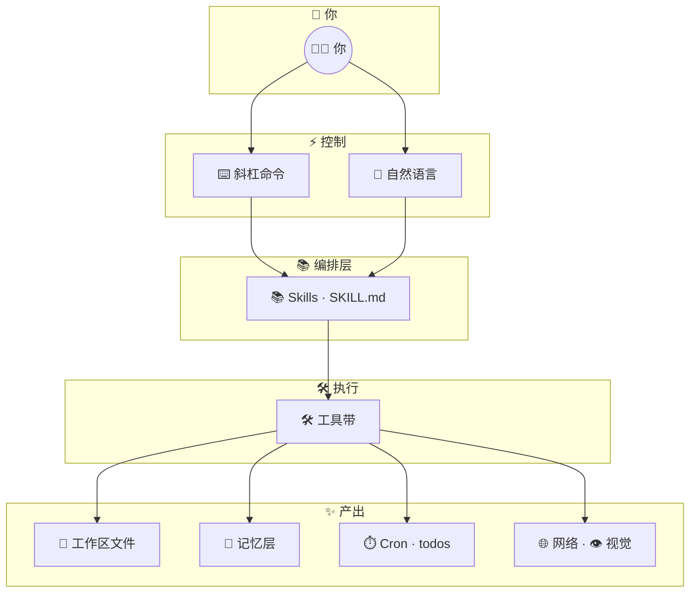
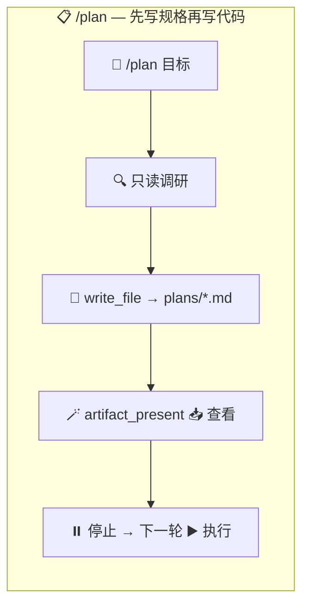
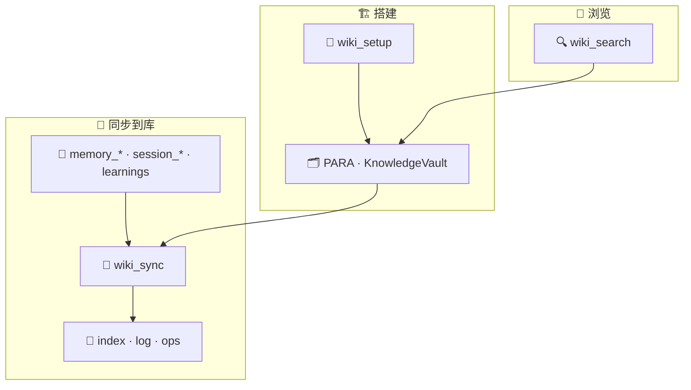
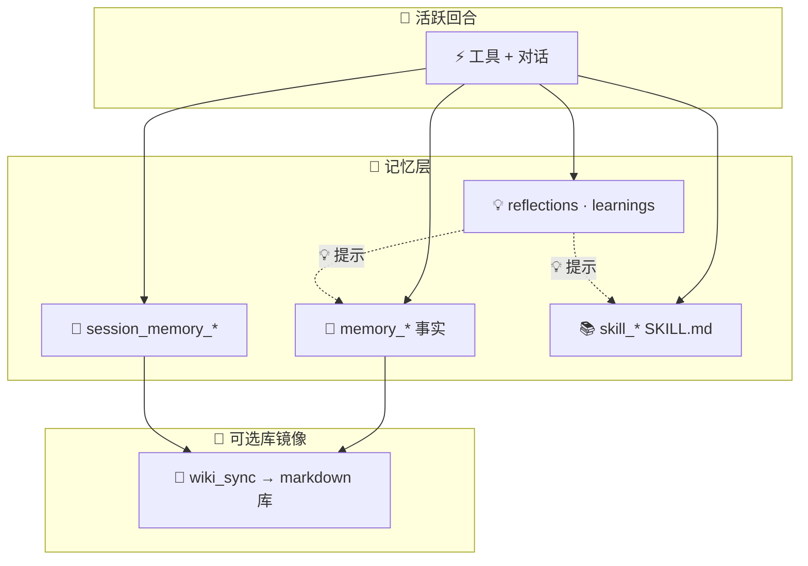

<div align="center">

# Web Agent

**在浏览器中运行的 AI 智能体：隔离工作区、持久化记忆、零安装门槛。**

[在线演示](https://webagent.aratech.ae) · [GitHub](https://github.com/nikola66/web-agent) · [在 Ko-fi 支持](http://ko-fi.com/nikola66) · [参与贡献](CONTRIBUTING.zh-CN.md) · [安全](SECURITY.md)

**语言：** [English](README.md) · [Español](README.es.md) · [简体中文](README.zh-CN.md) · [Deutsch](README.de.md)

</div>

<table>
  <tr>
    <td></td>
    <td></td>
    <td></td>
    <td></td>
    <td></td>
  </tr>
</table>

Web Agent 是一款在 WebContainers 之上、直接在浏览器中运行的开源 AI 智能体。使用时无需安装任何东西：没有 Docker、没有 VPS、没有虚拟机、没有 Mac mini、没有 Hostinger 盒子、也没有本地 Python 环境。打开应用、启动一个配置文件（profile），即可开始工作。

它既面向普通用户保持简单，也面向高级用户保持强大：隔离的 profile、浏览器本地持久化、工具、技能、会话、反思、学习记录、定时任务、**规划模式**（`/plan`）、**PARA + Obsidian 风格知识库**（`wiki_*` 工具与 `/wiki-*` 命令），以及留在用户本机上的自改进运行时。

## 目录

- [为何选择 Web Agent](#为何选择-web-agent)
- [快速开始](#快速开始)
- [功能亮点](#功能亮点)
- [工作原理](#工作原理)
- [斜杠命令](#斜杠命令)
- [设置与提供商](#设置与提供商)
- [工具](#工具)
- [技能](#技能)
- [工作区功能](#工作区功能)
- [持久化机制](#持久化机制)
- [开发](#开发)
- [架构速览](#架构速览)
- [隐私与安全](#隐私与安全)
- [参与贡献](#参与贡献)

## 为何选择 Web Agent

- **点开即用**。终端用户从浏览器启动，无需安装步骤。
- **默认隔离**。每个 profile 拥有独立的工作区、记忆与运行时状态。
- **自我学习**。技能、反思、学习记录、事实、会话记忆以及可选的 wiki 投影，帮助智能体随时间改进，同时不失去浏览器本地控制权。
- **本地优先持久化**。工作区、记忆、会话与技能保存在浏览器存储中，可导出并在之后重新导入。
- **托管但不存用户服务端状态**。托管演示仅提供应用，用户文件与智能体状态留在浏览器中。
- **轻量回合判定器**。轻量 ONNX 侧车对 continue/stop/ask_user 进行分类，避免脆弱的 regex 编排；确定性安全逻辑仍在 `turn.ts` 中。
- **开源**。在 MIT 许可证下可自由使用、分叉、修改与分发。

## 功能亮点

- 由 WebContainers 驱动的浏览器原生 Node.js 运行时
- 带独立工作区与记忆的隔离 profile
- 内置文件、Shell、搜索、抓取、记忆、会话、定时任务、技能及**知识库**（`wiki_setup`、`wiki_sync`、`wiki_search`）工具
- **`/plan` 规划模式**：调研工作区，将带日期的 markdown 计划保存到 `plans/`，通过 `artifact_present` 展示，然后在**后续**消息中执行
- **`/wiki_setup` · `/wiki_sync` · `/wiki_search`**：路由到 wiki 工具的确定性快捷方式（默认库根目录：`.webagent/knowledge-vault/`）
- 持久化事实库、滚动会话记忆、反思与学习记录
- 上传到实时工作区，图片可交给视觉工具
- API 密钥在浏览器本地加密存储
- 面向长期浏览器本地工作区的导出与导入流程
- 零门槛试用的托管演示
- **Turn judge** 侧车（`server/turn-judge`）：Fastify + ONNX，用于 stop/continue/ask_user，无需 regex 守门栈

## 快速开始

任选一条路径：

| 路径 | 适合 |
| --- | --- |
| [托管演示](#使用托管演示) | 零安装 — 打开应用并添加 API 密钥 |
| [本地开发](#本地运行) | 贡献者、自定义构建或离线使用 |

### 使用托管演示

打开 [webagent.aratech.ae](https://webagent.aratech.ae)，创建或选择一个 profile，从 [OpenRouter.ai](https://openrouter.ai) 或 [Ollama](https://ollama.com) 添加免费密钥，点击 **Launch**，开始对话。

在 OpenRouter 上 `Gemma4` 是不错的默认选择（速度、价格、工具调用、多模态）。任何兼容模型均可使用。

### 本地运行

```bash
git clone https://github.com/nikola66/web-agent.git
cd web-agent
git lfs install
git lfs pull
npm install
npm run dev
```

打开 `http://localhost:5173`。仅当需要重新训练 turn judge 时才需要 Python；捆绑的 ONNX 模型位于 `models/turn-judge/`。详见 [docs/turn-judge.md](docs/turn-judge.md)。

## 工作原理

Web Agent 不只是一个聊天框。它是一个浏览器原生智能体运行时，三层协同工作：

- `⌨️ Slash commands` 用于快速操作控制
- `🛠️ Tools` 在工作区与网络上执行具体动作
- `📚 Skills` 用于可复用流程与更高级行为



### 规划、知识库与自我学习

这三条循环与主能力图并列：**规划**在实现前产出可审阅的规格；**wiki** 将运行时记忆镜像为可浏览的 markdown（兼容 Obsidian）；**自我学习**随时间把事实、会话笔记、技能与反思串联起来。

#### 规划（`/plan`）



#### 知识库（`wiki_*` / `/wiki_*`）



#### 自我学习循环



要在**事实 / 会话 / 技能 / 库**之间做选择，可使用捆绑的 **`/memory-layers`** 技能。

### 能力速览

| 领域 | 包含内容 | 能做什么 |
| --- | --- | --- |
| `⌨️ Commands` | 如 `/help`、`/compact`、`/plan`、`/checkpoint`、`/wiki_*` 等会话控制 | 更快导航、恢复、规划、库操作与运维控制 |
| `🛠️ Workspace tools` | 读、写、编辑、diff、移动、搜索、Shell | 在隔离项目工作区内完成真实工作 |
| `🧠 Memory tools` | 事实、会话笔记、对话回溯 | 提升连续性的持久上下文 |
| `📓 Wiki tools` | `wiki_setup`、`wiki_sync`、`wiki_search` | PARA 形 markdown 库与搜索，当 memory 工具不够用时 |
| `📋 Planning` | `/plan` + `write_file` 写入 `plans/` + `artifact_present` | 先写规格再实现：本回合规划，下一回合执行 |
| `⏱️ Automation tools` | 心跳定时任务与待办 | 应用打开时的周期性任务 |
| `🌐 Remote tools` | 搜索、抓取、邮件、视觉、YouTube 字幕 | 联网与多模态任务执行 |
| `📚 Skills` | 可复用 `SKILL.md` 流程 | 无需重训模型即可使用更高级工作流 |

## 斜杠命令

这些命令让终端体验更像运维控制台，而不是普通聊天机器人。涵盖帮助、中断、上下文压缩、**规划模式**、**知识库**快捷方式、基于检查点的恢复，以及直接调用技能。

| 命令 | 作用 |
| --- | --- |
| `/help` | 显示内置命令与可用工具。 |
| `/clear` | 清空对话历史以开启新线程；保留智能体与用户身份。 |
| `/compact` | 摘要较早的上下文并继续当前线程。 |
| `/plan [goal]` | **规划模式：** 用只读工具调研工作区，将完整计划 markdown 写入 `plans/`，通过 `artifact_present` 展示，然后**停止** — 在**下一**回合回复「执行计划」（或修改意见）以开始实现。 |
| `/checkpoint [name]` | 保存当前历史的命名快照以便回滚。 |
| `/rollback [name]` | 列出检查点或恢复指定检查点。 |
| `/skills [search]` | 列出已安装技能，或按查询搜索技能。 |
| `/wiki_setup [path]` | 初始化 PARA + wiki 脚手架（`Projects/`、`Areas/`、`Resources/KnowledgeVault/…`、`Archives/`）。可选工作区相对根路径；默认 **`.webagent/knowledge-vault`**。仍使用旧默认库目录 **`knowledge-vault/`** 的工作区，在下次省略 `root_path` 的 wiki 操作时会自动迁移。 |
| `/wiki_sync [scope] [path]` | 将运行时投影推入库：**`facts`**、**`session`** 或 **`all`**（含 learnings）。`scope` 后可跟可选路径。需先执行 `wiki_setup`。 |
| `/wiki_search <query>` | 在 wiki 库下搜索 markdown（排序命中 + 片段）。 |
| `/<skill> [task]` | 为任务调用已安装技能。 |
| `/stop` | 中断当前运行。 |
| `/exit` | 退出当前终端智能体会话。 |

> `📌 提示：` 用 `/skills` 发现能力，然后用 `/<skill-slug> [task]` 直接进入工作流。

> `📌 提示：` 自然语言如「搭建我的知识库」或「把事实同步到 wiki」会映射到与 `/wiki_*` 斜杠命令相同的 **`wiki_*`** 工具。

## 设置与提供商

Web Agent 在两处暴露提供商配置：活动聊天/模型提供商的 profile 编辑器，以及浏览器路由 Web 工具与邮件投递的设置侧栏。

### 模型提供商

每个 profile 可选择自己的提供商、可选模型覆盖、API 密钥与个性。当前内置 profile 提供商：

| 提供商 | 类型 | 说明 |
| --- | --- | --- |
| `OpenRouter` | 托管模型路由 | 默认提供商，一个密钥访问多种模型。 |
| `Ollama (cloud)` | 托管 OpenAI 兼容提供商 | 使用 Ollama 云 API，而非本地守护进程。 |
| `Custom (OpenAI-compatible)` | 自带端点 | 支持自定义 base URL 与 API 密钥，对接兼容 `/v1` 的提供商。 |

### 浏览器工具提供商

这些在设置面板中为内置 Web 操作提供能力：

| 提供商 | 驱动 | 说明 |
| --- | --- | --- |
| `TinyFish` | `web_search`、`web_fetch` | 在设置中配置的默认浏览器工具提供商。 |
| `Resend` | `email` | 用于通过已验证发件地址发送外发邮件。 |

### 可配置项

- `🧠 Per-profile model provider`：为每个智能体 profile 选择模型后端。
- `🔧 Model override`：指定具体模型，而非提供商默认。
- `🔐 Per-profile API key`：与其他 profile 分开存储凭据。
- `🌐 Custom base URL`：将自定义提供商指向任意 OpenAI 兼容端点。
- `✉️ Email delivery`：为摘要或外发邮件流程添加 Resend 凭据。

## 工具

Web Agent 自带丰富的原生工具集。内置项覆盖工作区操作、搜索、记忆、自动化、技能管理，以及经浏览器路由的远程操作。

### 工具分组

| 分组 | 包含 | 适用于 |
| --- | --- | --- |
| `📁 Files & Workspace` | `read_file`、`write_file`、`edit_file`、`multi_edit`、`move_file`、`delete_file`、`tree`、`list_dir`、`find_files`、`grep`、`file_diff`、`file_stat`、`make_dir` | 构建、编辑、检查与组织项目文件 |
| `🧠 Memory & Recall` | `memory_save`、`memory_recall`、`memory_search`、`session_memory_append`、`session_memory_list`、`session_search` | 长期事实、滚动笔记与恢复先前上下文 |
| `📓 Knowledge wiki` | `wiki_setup`、`wiki_sync`、`wiki_search` | 工作区下 PARA + Obsidian 友好库；将项目事实/会话/learnings 投影为 markdown；全文库搜索 |
| `📚 Skills` | `skill_list`、`skill_view`、`skill_save`、`skill_manage`、`skill_bulk_save`、`skill_delete`、`skill_recall` | 发现、阅读、创建、导入与维护技能 |
| `⏱️ Automation` | `cron_register`、`cron_list`、`todo_write` | 周期性任务、心跳驱动工作流与清单 |
| `🌐 Remote & Multimodal` | `web_search`、`web_fetch`、`vision_analyze`、`youtube_transcribe`、`email` | 调研、抓取实时内容、图像分析、字幕与外发 |
| `🖥️ System & Output` | `run_shell`、`system_info`、`artifact_present`、`apply_patch` | 执行命令、查看环境、展示产物与精确补丁 |

<details>
<summary><strong>🛠️ 完整工具目录</strong></summary>

| 工具 | 作用 |
| --- | --- |
| `🩹 apply_patch` | 应用统一补丁操作以精确修改文件。 |
| `🪄 artifact_present` | 向浏览器宿主展示 markdown，支持查看或下载。 |
| `📋 cron_list` | 列出 `.cronjobs.json` 中的心跳定时任务。 |
| `⏱️ cron_register` | 注册在应用标签页打开时运行的周期性心跳任务。 |
| `🗑️ delete_file` | 从工作区删除文件。 |
| `🛠️ edit_file` | 替换匹配片段或完整替换文件内容。 |
| `✉️ email` | 通过已配置 Resend 的外发邮件。 |
| `🧾 file_diff` | 显示两个 UTF-8 工作区文件之间的行级 diff。 |
| `📌 file_stat` | 返回工作区路径的文件系统元数据。 |
| `🔎 find_files` | 按 glob 式文件名模式查找文件。 |
| `🔍 grep` | 按文本或正则搜索文件内容。 |
| `📁 list_dir` | 列出工作区文件与目录，可选递归与过滤。 |
| `📂 make_dir` | 在工作区内递归创建目录。 |
| `🧠 memory_recall` | 按精确键召回已保存的记忆事实。 |
| `💾 memory_save` | 以稳定键保存持久记忆事实。 |
| `🔮 memory_search` | 按子串搜索已保存的记忆事实。 |
| `📦 move_file` | 移动或重命名工作区路径。 |
| `🛠️ multi_edit` | 在单个文件中应用多次查找替换。 |
| `📄 read_file` | 从工作区读取 UTF-8 文件。 |
| `🖥️ run_shell` | 在工作区运行时中执行 Shell 命令。 |
| `📝 session_memory_append` | 向滚动会话记忆追加轻量笔记。 |
| `🗂️ session_memory_list` | 读取滚动会话记忆中的最新条目。 |
| `📇 session_search` | 按关键词搜索已归档的工作区对话。 |
| `📚 skill_bulk_save` | 一次批量导入或保存多个技能。 |
| `🗑️ skill_delete` | 从工作区库中删除已保存技能。 |
| `📋 skill_list` | 搜索并列出已保存技能。 |
| `🧠 skill_manage` | 创建、打补丁、编辑、删除、导入或管理可复用技能。 |
| `🔍 skill_recall` | 按名称加载原始 `SKILL.md`（向后兼容）。 |
| `📚 skill_save` | 立即保存可复用 `SKILL.md` 流程。 |
| `📖 skill_view` | 加载技能的完整 `SKILL.md` 或允许的支持文件。 |
| `📟 system_info` | 返回安全系统快照（时间、时区、运行时间、内存等）。 |
| `✅ todo_write` | 创建或更新清单式待办。 |
| `🌲 tree` | 渲染有界目录树视图。 |
| `🖼️ vision_analyze` | 用已配置视觉模型分析图像。 |
| `🌐 web_fetch` | 抓取并摘要 URL 内容。 |
| `🔍 web_search` | 搜索 Web 并返回排序结果。 |
| `📓 wiki_search` | 在 wiki 库根下搜索 markdown；当 `memory_search` 不够时使用排序片段。 |
| `📓 wiki_setup` | 创建 PARA + `Resources/KnowledgeVault/` 脚手架（幂等）。 |
| `🔄 wiki_sync` | 从事实、会话尾部和/或 learnings 更新库 `index.md` / `log.md` 并写入 `ops/wiki-sync-*.md`。 |
| `✍️ write_file` | 写入文件文本并按需创建父目录。 |
| `📹 youtube_transcribe` | 获取带时间戳的完整 YouTube 字幕。 |

</details>

## 技能

技能是以 `SKILL.md` 文件存储的可复用流程。它们让 Web Agent 从原始工具使用切换到可按需调用的结构化工作流。

### 捆绑技能

| 斜杠命令 | 名称 | 用途 | 标签 |
| --- | --- | --- | --- |
| `/clarify` | Clarify | 在用户意图模糊时输出一个结构化澄清块，供 UI 展示选项而非猜测。 | `ux`, `ambiguity`, `clarification`, `dialog` |
| `/project-scaffold` | Project Scaffold | 在生成文件前为新应用、演示、尖峰、沙箱或测试脚手架创建隔离工作区文件夹。 | `project`, `scaffold`, `verification` |
| `/research-pack` | Research Pack | 使用现有 Web 工具（如 arXiv、Semantic Scholar 路径）运行学术研究工作流。 | `research`, `papers`, `citations`, `academic`, `arxiv`, `semantic-scholar` |
| `/systematic-debugging` | Systematic Debugging | 对 Bug 与不稳定行为使用轻量假设—实验循环。 | `debugging`, `reliability`, `investigation`, `science` |
| `/memory-layers` | Memory Layers | 在事实、会话笔记、技能与 wiki 投影之间选对层 — 避免重复或矛盾的存储上下文。 | `memory`, `session`, `skills`, `facts`, `context` |
| `/web-agent-skill` | Web Agent Skill | 利用运行时、记忆层、定时任务、捆绑技能与仓库事实安全演进 Web Agent。 | `web-agent`, `self-evolution`, `maintenance`, `skills`, `memory`, `cron` |

更多捆绑技能见 `/skills`；上表为常见起点。

### 技能的价值

- `🧩 Reusable`：优秀工作流只需写一次。
- `🛡️ Safer`：技能在智能体改文件前编码首选模式。
- `⚡ Faster`：`/skill-slug [task]` 比每会话重讲工作流更快。
- `🧠 Teachable`：用户可将新流程直接保存到工作区以扩展智能体。

### Wiki 与 memory（简表）

- **`memory_*` / `session_*`** 保存运行时使用的规范结构化上下文。
- **`wiki_sync`** 将摘要与同步标记投影为人类可读的 markdown（或 Obsidian）；除非有意在库中归档散文，否则将库视为**可浏览镜像**，而非第二真相源。

## 工作区功能

每个 profile 在浏览器存储中拥有独立的隔离工作区。工作区层设计为轻量项目环境，而不只是附件桶。

| 功能 | 含义 |
| --- | --- |
| `📁 Isolated per profile` | 每个智能体 profile 拥有独立工作区与运行时状态。 |
| `💾 Persistent snapshots` | 文件通过浏览器侧持久化在刷新后保留。 |
| `📤 Export / Import` | 工作区标签页可将 profile 快照导出为 JSON 并在之后导入。 |
| `🖼️ Upload handoff` | 上传文件进入实时工作区，含供视觉工具使用的图像路径。 |
| `🧰 File operations` | 读、写、编辑、diff、移动、删除、列表、grep、tree 工具均在工作区内操作。 |
| `🖥️ Live shell access` | 运行时可在浏览器原生 Node 环境中执行受支持的工作区命令。 |
| `📋 Saved plans` | `/plan` 将带时间戳的 markdown 写入 **`plans/`**（工作区相对路径；旧版 `.webagent/plans/` 仍可读）。 |
| `📓 Knowledge vault` | 默认 **`.webagent/knowledge-vault/`** PARA 树，**`Resources/KnowledgeVault/`** 用于 `wiki_sync` 后的 wikilink、日志与 ops 详情文件。旧版工作区根 **`knowledge-vault/`** 在使用默认 wiki 路径时会自动迁移。 |
| `🧹 Clean reset` | 从侧栏销毁单个 profile 工作区或清除全部本地智能体状态。 |
| `📊 Storage visibility` | 工作区标签页显示浏览器存储用量与配额。 |

### 工作区 UX

- `Workspaces tab`：为活动 profile 导出、导入、销毁并查看浏览器存储用量。
- `Files popup`：浏览实时 `/workspace`、预览文件并与工作树交互。
- `uploads/`：用户上传资源规范化到 `uploads/` 以供工具安全访问。

## 持久化机制

Web Agent 将用户状态保存在用户机器的浏览器存储中，包括工作区、会话、记忆、事实、learnings、技能、待办、定时任务元数据、保存在 **`plans/`** 下的 **`/plan`** markdown（旧版 `.webagent/plans/` 路径仍可读）、默认位于 **`.webagent/knowledge-vault/`** 的 wiki 库文件（当 wiki 工具在未指定 `root_path` 运行时，工作区根的旧版 **`knowledge-vault/`** 会自动迁移），以及本地凭据。这些持久智能体状态不应存放在服务器上。

只要浏览器保留本地存储与 OPFS 数据，智能体就保留历史与工作区。需要可移植时，导出工作区或浏览器本地状态，之后可在本机或其他机器导入。

托管部署的安全表述：

- **应用可托管在任何地方**
- **智能体状态在浏览器中**
- **服务器只应交付应用，并在需要时代理允许的上游请求**

**自托管（Railpack / Dokploy）：** 使用仓库 `railpack.json` 的 `deploy.startCommand`（`scripts/start-with-proxy.sh`）与 `deploy.aptPackages`（在默认包基础上增加 `caddy`）。不要在 `package.json` 中添加 `start` 脚本：Railpack 会将其视为自定义启动命令、跳过内置静态 + Caddy 镜像路径，侧车配置会失效。已检入的 `Caddyfile` 匹配 **Debian apt 版 Caddy（约 2.6）**（无 `persist_config` 或全局 `trusted_proxies` 块）。未使用 TinyFish 时，`web_fetch` / `web_search` 依赖 `scripts/cors-proxy-server.mjs` 中的小型 Node 监听（默认 `127.0.0.1:8799`）。

**Turn judge：** 预训练 ONNX 模型位于 `models/turn-judge/`（克隆后执行 `git lfs pull`）。`npm run dev` 会与应用一起启动 judge（端口 `8787`）。生产环境 `scripts/start-with-proxy.sh` 在 `npm run build` 后启动已构建的侧车。仅当需要禁用时设置 `WEBAGENT_TURN_JUDGE=0`。完整设置、验证与可选重训练：[docs/turn-judge.md](docs/turn-judge.md)。

## 开发

```bash
npm run dev
npm run build
npm run test
npm run judge:test
npm run test:browser
```

Turn judge（可选重训练）：编辑 `data/turn-judge/*.jsonl`，然后 `npm run judge:train`。

面向贡献者的文档：

- [CONTRIBUTING.zh-CN.md](CONTRIBUTING.zh-CN.md)
- [AGENTS.md](AGENTS.md) — AI 编码智能体规则
- [CAPABILITIES.md](CAPABILITIES.md)
- [docs/ARCHITECTURE.zh-CN.md](docs/ARCHITECTURE.zh-CN.md) — 系统结构、IPC 协议、存储层
- [docs/turn-judge.md](docs/turn-judge.md) — judge 侧车部署、验证、重训练
- [docs/agent-notes.md](docs/agent-notes.md)
- [docs/testing-checklist.md](docs/testing-checklist.md)

## 架构速览

- **Frontend**：React + Vite + xterm.js
- **Runtime**：WebContainers 内的 Node.js
- **Persistence**：浏览器中的 IndexedDB + OPFS
- **Isolation**：按 profile 划分的工作区与运行时状态
- **Model access**：OpenRouter 或 OpenAI 兼容提供商
- **Turn judge**：`server/turn-judge` ONNX 分类器，用于 continue/stop/ask_user（确定性安全仍在 `turn.ts`）
- **Plans & vault**：`plans/` 下带时间戳的计划（旧版 `.webagent/plans/` 可读）；通过 `wiki_*` 工具同步的 PARA wiki 树（默认 `.webagent/knowledge-vault/`）

智能体运行时嵌入浏览器应用，挂载到实时工作区，并在终端支撑的 Node 环境中启动。Profile 将个性、设置、工作区状态与记忆彼此隔离。

## 隐私与安全

- 工作区文件、会话、记忆、技能与本地凭据均留在浏览器侧。
- API 密钥在本地存储并加密后持久化。
- Profile 彼此隔离。
- 托管模式对上流请求应仅为中转，不应作为用户状态的持久化后端。

报告与安全立场详见 [SECURITY.md](SECURITY.md)。

## 开源

Web Agent 是开源项目。您可在 [MIT License](LICENSE) 下自由使用、分叉、修改与分发。

灵感来自 OpenClaw、[Hermes Agent](https://github.com/NousResearch/hermes-agent) 与 OpenCrabs。

特别感谢 Nodebox 所用技术及其背后的开源项目。那是出色的软件，使 Web Agent 成为可能。

## 支持与赞助

若 Web Agent 为您节省时间或助力工作，欢迎在 [Ko-fi](http://ko-fi.com/nikola66) 支持持续开发。赞助有助于维护、新能力、UI 打磨与长期改进。

<table>
  <tr>
    <td align="center"><a href="http://ko-fi.com/nikola66">在 Ko-fi 支持</a></td>
    <td align="center"><a href="https://github.com/nikola66/web-agent">在 GitHub 加星</a></td>
  </tr>
</table>

### 赞助本项目

<table>
  <tr>
    <td align="center"><br />赞助位<br />在此放置 Logo</td>
    <td align="center"><br />赞助位<br />在此放置 Logo</td>
    <td align="center"><br />赞助位<br />在此放置 Logo</td>
  </tr>
</table>

## 参与贡献

欢迎提交 Issue 与 Pull Request。请先阅读 [CONTRIBUTING.zh-CN.md](CONTRIBUTING.zh-CN.md)，保持改动精准，并优先选择能保留项目浏览器原生、本地优先设计的修复。

## 许可证

MIT。详见 [LICENSE](LICENSE)。
