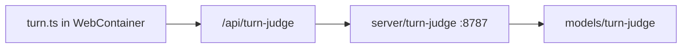

# Turn judge (local deploy)

The turn judge is a small ONNX sidecar that decides whether the agent should **continue**, **stop**, or **ask the user** after each assistant step. A pre-trained model ships in [`models/turn-judge/`](../models/turn-judge/). You do **not** need Python or retraining for normal local use.

## What it does

- **Classifier:** MiniLM-based 3-way head (`CONTINUE` / `STOP` / `ASK_USER`) in [`server/turn-judge/`](../server/turn-judge/).
- **Runtime:** [`src/agent/runtime/turn.ts`](../src/agent/runtime/turn.ts) calls the judge over HTTP; deterministic safety (max rounds, text-only, topic pivot, auto-continue cap) stays in the runtime.
- **Browser:** The embedded agent uses same-origin `POST /api/turn-judge` (Vite dev proxy or Caddy in production), not `127.0.0.1` directly.



## Default local deploy (no training)

```bash
git clone https://github.com/nikola66/web-agent.git
cd web-agent
git lfs install
git lfs pull
npm install
npm run dev
```

Open [http://localhost:5173](http://localhost:5173). `npm run dev` starts Vite and the judge sidecar on port **8787** (see root [`package.json`](../package.json)).

Root `npm install` also installs judge sidecar dependencies via `postinstall`.

## Verify the judge

**Health:**

```bash
curl -s http://127.0.0.1:8787/health
```

**Sample decision** (mid-task after a tool; should tend toward `continue`):

```bash
curl -s -X POST http://127.0.0.1:8787/judge \
  -H 'content-type: application/json' \
  -d '{"messages":[{"role":"user","content":"Continue the marketing outreach plan"},{"role":"assistant","content":"Now that the workspace is ready, I'\''m drafting the core outreach strategy. I'\''m creating a strategy.md with the target segments."}],"toolState":{"executedToolsInTurn":true,"lastToolNames":["make_dir"],"lastToolErrorCount":0,"totalToolCallsInTurn":1},"runtimeState":{"round":2,"maxRounds":64,"autoContinueNudges":0,"maxAutoContinueNudges":20,"textOnly":false,"planMode":false}}'
```

**In the UI:** Relaunch the agent profile after changing judge code or model files. With `VITE_WEBAGENT_DEBUG_LOG=1`, look for dim lines like `▸ turn judge · continue (model, …)` in the terminal panel.

**Sidecar tests:**

```bash
npm run judge:test
```

## Environment variables

Copy [`.env.example`](../.env.example) to `.env` if you need overrides.

| Variable | Default | Purpose |
|----------|---------|---------|
| `TURN_JUDGE_PORT` | `8787` | Sidecar listen port |
| `TURN_JUDGE_URL` | `http://127.0.0.1:8787/judge` | Node-only direct URL |
| `WEBAGENT_TURN_JUDGE` | on (`1`) | Set `0` to disable judge |
| `WEBAGENT_TURN_JUDGE_SHADOW` | off | Log decisions when judge disabled |
| `WEBAGENT_TURN_JUDGE_HOST` | `127.0.0.1` | Caddy upstream host (production) |
| `VITE_WEBAGENT_DEBUG_LOG` | `0` | Extra JSONL + judge stop lines |

The browser runtime sets `TURN_JUDGE_URL` to `${origin}/api/turn-judge` when the profile launches ([`src/agent/adapter.ts`](../src/agent/adapter.ts)).

## Production / self-hosting

After `npm run build`, [`scripts/start-with-proxy.sh`](../scripts/start-with-proxy.sh) starts:

1. CORS proxy (`8799`)
2. Built judge (`server/turn-judge/dist/server.js`)
3. Caddy (serves `dist/`, proxies `/api/turn-judge` → judge)

See [README.md](../README.md) (Railpack / Dokploy) and [`Caddyfile`](../Caddyfile).

## Optional: expand training knowledge

Only needed if you want to improve or replace the bundled model.

1. **Add examples** to [`data/turn-judge/`](../data/turn-judge/) (`train.jsonl`, `val.jsonl`, `test.jsonl`). Each line is `{"text":"…","label":"CONTINUE"|"STOP"|"ASK_USER"}` using the same `TASK:` / `MESSAGES:` / `TOOL_STATE:` / `RUNTIME_STATE:` shape as existing rows.

2. **Python venv** (one-time):
   ```bash
   python3 -m venv .venv-turn-judge
   .venv-turn-judge/bin/pip install torch transformers datasets accelerate onnx onnxruntime onnxscript
   ```

3. **Train and export ONNX:**
   ```bash
   npm run judge:train
   ```
   Overwrites artifacts under `models/turn-judge/` (restart `npm run dev` afterward).

The bundled dataset is a **bootstrap** set (~57 examples). Quality improves as you add real turn traces and retrain.

## Troubleshooting

| Symptom | Likely cause | Fix |
|---------|----------------|-----|
| `classifier_unavailable` in judge response | Missing ONNX/tokenizer under `models/turn-judge/` | Run `git lfs pull`; confirm files in [models/turn-judge/README.md](../models/turn-judge/README.md) |
| Agent stops mid-task after tools | Judge unreachable or low-confidence fallback | Check `curl` health/POST above; restart `npm run dev` |
| `OPTIONS /judge` 404 | Stale sidecar | Restart dev; ensure latest `server/turn-judge` |
| Judge works in curl but not in browser | Profile not relaunched, or WebContainer could not reach host | Stop agent, launch profile again; runtime uses IPC proxy for judge in Nodebox |
| `turn_judge_unavailable` in terminal | Same as above — sandbox `fetch` to `localhost:5173` fails | Relaunch profile after `npm run build:embed-runtime` (IPC bridge fix) |
| `npm run judge:dev` fails on import | Sidecar deps missing | Run `npm install` at repo root |

If the judge is unreachable, [`turn.ts`](../src/agent/runtime/turn.ts) fails closed to **stop** (see [ARCHITECTURE.md](ARCHITECTURE.md)).

## Related docs

- [ARCHITECTURE.md](ARCHITECTURE.md) — agent loop step 7
- [agent-notes.md](agent-notes.md) — runtime integration notes
- [testing-checklist.md](testing-checklist.md) — manual judge checks
