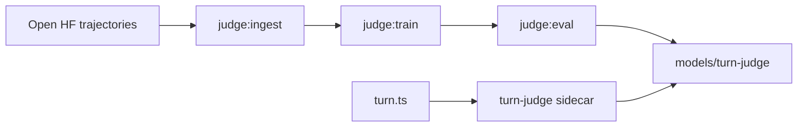

# Turn judge (local deploy)

The turn judge is a small ONNX sidecar that decides whether the agent should **continue**, **stop**, or **ask the user** after each assistant step. A pre-trained model ships in [`models/turn-judge/`](../models/turn-judge/). You do **not** need Python or retraining for normal local use.

## What it does

- **Classifier:** MiniLM-based 3-way head (`CONTINUE` / `STOP` / `ASK_USER`) in [`server/turn-judge/`](../server/turn-judge/).
- **Model-only sidecar:** [`server/turn-judge/src/turn-judge.ts`](../server/turn-judge/src/turn-judge.ts) runs the classifier and returns its decision. No regex or heuristic safety layers in the judge.
- **Runtime:** [`src/agent/runtime/turn.ts`](../src/agent/runtime/turn.ts) calls the judge over HTTP and trusts the result. Numeric loop guards only (max rounds, plan-goal budget, auto-continue nudge count, loop guardrails).
- **Browser:** Same-origin `POST /api/turn-judge` (Vite dev proxy or Caddy in production).



## Default local deploy (no training)

```bash
git clone https://github.com/nikola66/web-agent.git
cd web-agent
git lfs install
git lfs pull
npm install
npm run dev
```

Open [http://localhost:5173](http://localhost:5173). `npm run dev` starts Vite and the judge sidecar on port **8787**.

## Verify the judge

```bash
curl -s http://127.0.0.1:8787/health
npm run judge:test
```

Expect dim lines like `▸ turn judge · stop (model, 98%) — label:STOP` (always `source: model` when ONNX is loaded).

## Environment variables

| Variable | Default | Purpose |
|----------|---------|---------|
| `TURN_JUDGE_PORT` | `8787` | Sidecar listen port |
| `WEBAGENT_TURN_JUDGE` | on (`1`) | Set `0` to disable judge |
| `WEBAGENT_TURN_JUDGE_SHADOW` | off | Log judge decisions while disabled |
| `VITE_WEBAGENT_DEBUG_LOG` | `0` | JSONL debug log |

## Retrain from open data

One-time Python venv:

```bash
python3 -m venv .venv-turn-judge
.venv-turn-judge/bin/pip install torch transformers datasets accelerate onnx onnxruntime onnxscript
```

Pipeline:

```bash
# 1) Ingest open trajectories → data/turn-judge/*.jsonl (≤10k rows total)
npm run judge:ingest
# Optional: --max_total_rows 10000  |  --seeds_only

# 2) Train + export ONNX (runs eval after train by default)
npm run judge:train

# 3) Gate deploy on held-out metrics
npm run judge:eval
```

**Data sources:** primarily [nebius/SWE-agent-trajectories](https://huggingface.co/datasets/nebius/SWE-agent-trajectories) (structural labels: mid-step → `CONTINUE`, terminal step → `STOP`), merged with in-repo seed rows for web-agent phrasing and `ASK_USER`.

**Do not ship a new ONNX** until `judge:eval` passes (default thresholds: accuracy ≥ 0.95, ≥ 99% of correct predictions with confidence ≥ 0.99, false-continue on `STOP` ≤ 2%).

Serializer contract: [`server/turn-judge/src/serialize-judge-input.ts`](../server/turn-judge/src/serialize-judge-input.ts) — mirrored in Python ingest; golden fixture at [`tests/fixtures/turn-judge-serialize-golden.json`](../tests/fixtures/turn-judge-serialize-golden.json).

## Troubleshooting

| Symptom | Likely cause | Fix |
|---------|----------------|-----|
| `classifier_unavailable` / `source: error` | Missing ONNX | `git lfs pull`; restart dev |
| `turn_judge_unavailable` | Judge unreachable from WebContainer | Relaunch agent profile |
| Wrong continue/stop | Stale model | `judge:ingest` → `judge:train` → `judge:eval` |

## Related docs

- [ARCHITECTURE.md](ARCHITECTURE.md)
- [testing-checklist.md](testing-checklist.md)
