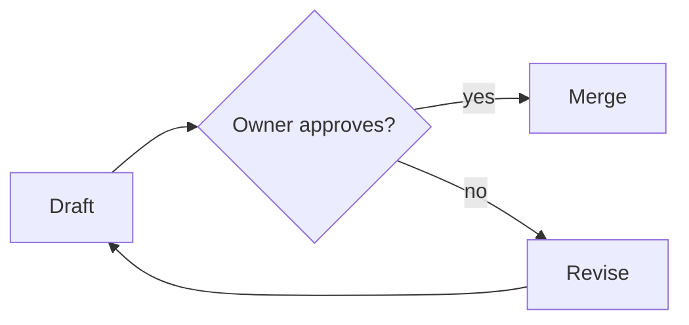
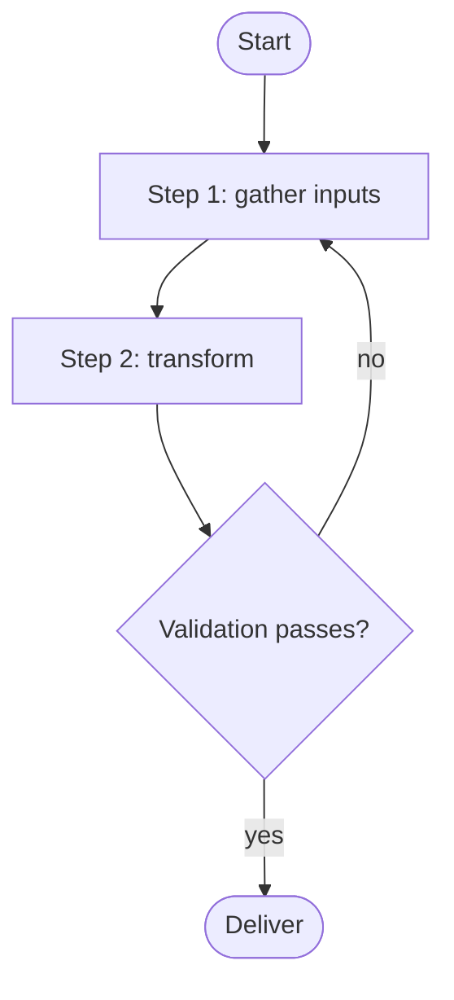
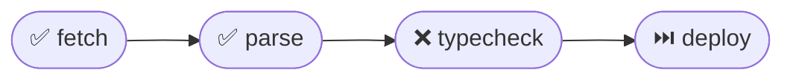
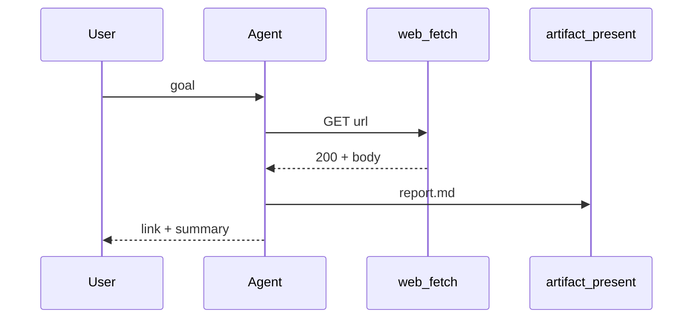

## When to Use

- Any plan, multi-step workflow, system architecture, decision tree, or sequence of interactions — pair it with a diagram.
- Comparisons, state machines, timelines, dependency graphs, or hierarchies.
- Drafting **any markdown document** (reports, RFCs, vault pages, run reports) — **default to including at least one chart** when a flow, structure, or comparison is described in prose.
- User says "draw", "diagram", "visualize", "flowchart", "show me the flow".

## Why it matters

Humans absorb structure faster from a diagram than from prose. Even a 4-node flowchart cuts onboarding time and reveals gaps the text hides. Defaulting to **include a chart** when one fits is a quality signal, not decoration.

## Relation to other skills (canonical handoffs)

- Called by **`task-planning`** to render the proposed plan as a flowchart before execution.
- Called by **`task-execution`** to embed a step-status diagram inside the final run report.
- Called by **`systematic-debugging`** to draw the fault tree / hypothesis lattice.
- Called by **`project-scaffold`** to show the new folder tree as a `graph` or file-tree diagram.
- Called by **`knowledge-vault`** for PARA / topic-map pages.
- Delivery surface owned by **`artifact-delivery`** — render charts inside `artifact_present` (the host renders Mermaid in the preview modal).

## Diagram types and when to pick each

| Need | Mermaid type | Header |
|------|--------------|--------|
| Process / branching flow | flowchart | ` ```mermaid\nflowchart TD` |
| Time-ordered interaction between actors | sequenceDiagram | ` ```mermaid\nsequenceDiagram` |
| Lifecycle / states | stateDiagram-v2 | ` ```mermaid\nstateDiagram-v2` |
| Plan or timeline | gantt | ` ```mermaid\ngantt` |
| Concept map / hierarchy | mindmap | ` ```mermaid\nmindmap` |
| Comparison / quadrant | quadrantChart | ` ```mermaid\nquadrantChart` |
| Class / data model | classDiagram | ` ```mermaid\nclassDiagram` |
| Entity relationships | erDiagram | ` ```mermaid\nerDiagram` |
| Trend over discrete points | xychart-beta | ` ```mermaid\nxychart-beta` |
| Pie share | pie | ` ```mermaid\npie` |

When in doubt → **flowchart TD** with 4–8 labeled nodes.

## Authoring rules

1. **Fence with `mermaid`.** Always emit a fenced code block whose info-string is exactly `mermaid` (lowercase). The artifact preview renders SVG from this fence; any other language tag is treated as a literal code listing.
2. **Keep it scannable.** 4–12 nodes is the sweet spot. If you need more, split into two diagrams or use a hierarchical subgraph.
3. **Label every edge** that carries semantic weight (`-->|approved|`, `-->|fails|`). Unlabeled arrows are fine for trivial linear flows.
4. **Quote labels with special chars.** Wrap labels containing `()`, `:`, `/`, `&`, or quotes in `["…"]` so Mermaid does not choke on the parse.
5. **Direction first.** Flowcharts: `TD` (top-down) for plans, `LR` (left-right) for pipelines. Be consistent inside one document.
6. **Avoid styling unless asked.** Default theme is fine; bespoke `classDef` colors usually do more harm than good in a quick draft.
7. **Validate locally first** — when the diagram is non-trivial, drop the source into the artifact preview and confirm it renders before claiming the task complete.

## Embedding pattern

Always show the chart **inside** the markdown deliverable, not as a sibling file:

````markdown
## Approval flow



The flow is: …
````

For multi-step run reports (see **`task-execution`**), put the chart **above** the step-breakdown table — readers see structure first, detail second.

## Pitfalls

- Forgetting the `mermaid` info-string — the block stays as a plain `<pre>` and no SVG renders.
- Unclosed brackets / mismatched arrow syntax — parser errors. Keep diagrams small enough to spot the issue.
- Inlining a 40-node diagram — unreadable; split or summarize.
- Using HTML inside labels — Mermaid in `securityLevel: "strict"` (host config) will strip or refuse.
- Treating a chart as a *substitute* for prose — it is a **complement**; keep the surrounding sentences.

## Anti-patterns

- Pasting an ASCII-art box diagram when Mermaid would render properly.
- Generating a chart "for completeness" when one box plus an arrow says nothing the sentence above did not.
- Coloring nodes manually to convey status when status icons in a sibling table already do the job (see **`task-execution`** report shape).

## Quick recipes

**Plan as flowchart (pair with `task-planning`):**

````markdown

````

**Step status (pair with `task-execution` report):**

````markdown

````

**Sequence diagram for a tool-use round-trip:**

````markdown

````
